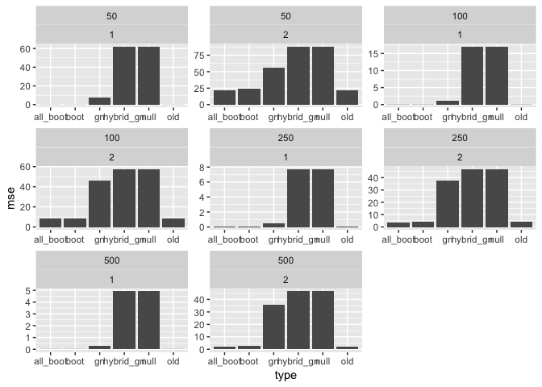

*G**n* comparison simulation results
================

In these simulations, I consider six different types of possible ways of creating synthetic estimators.

-   *Old*: this is the original way we have always done things, using raw differences: $\\hat{\\Delta} = \\hat{\\theta}\_i - \\hat{\\theta}\_0$.
-   *Boot*: this

