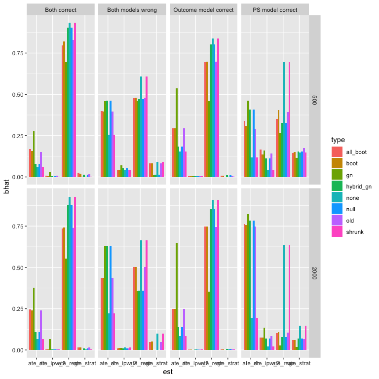

*G**n* comparison simulation results
================

In these simulations, I consider six different types of possible ways of creating synthetic estimators. When *θ*0 is specified, it is the DR. Kang and Shafer is used throughout.

-   *Old*: this is the original way we have always done things, using raw differences: $\\hat{\\Delta} = \\hat{\\theta}\_i - \\hat{\\theta}\_0$.
-   *Boot*: this replaces $\\hat{\\theta}\_i$ with the mean of its bootstrapped versions $\\bar{\\theta}^\*\_i$
-   *All\_boot*: this replaces both quantities with their bootstrapped versions: $\\hat{\\Delta} = \\bar{\\theta}^\*\_i - \\bar{\\theta}^\*\_0$
-   *Gn*: this generates data using a regression forest to predict the outcome and randomly bootstrapping the covariates (and their associated predicted *y*s) and also separately bootstrapping their errors. The bias is estimated by comparing to the regression-forest-based 'true' ATE.
-   *Null*: this is the so-called tree-based method we've been using, where we remove the treatment effect and then bootstrap, and compare to a null ATE.
-   *Hybrid\_gn*: this uses the typical bootstrap, but the bias is estimated by comparing to the regression-forest-based 'true' ATE. It is a hybrid of the previous two methods.

### MSE comparison

|    j|    n| d   | type       |         mse|
|----:|----:|:----|:-----------|-----------:|
|    1|   50| ks  | all\_boot  |   0.1191991|
|    1|   50| ks  | boot       |   0.1194104|
|    1|   50| ks  | gn         |   7.9448291|
|    1|   50| ks  | hybrid\_gn |  61.9941178|
|    1|   50| ks  | null       |  61.9941178|
|    1|   50| ks  | old        |   0.1205268|
|    1|  100| ks  | all\_boot  |   0.0631049|
|    1|  100| ks  | boot       |   0.0636964|
|    1|  100| ks  | gn         |   1.1645244|
|    1|  100| ks  | hybrid\_gn |  17.0171936|
|    1|  100| ks  | null       |  17.0171936|
|    1|  100| ks  | old        |   0.0637945|
|    1|  250| ks  | all\_boot  |   0.0244750|
|    1|  250| ks  | boot       |   0.0248059|
|    1|  250| ks  | gn         |   0.4496017|
|    1|  250| ks  | hybrid\_gn |   7.7484658|
|    1|  250| ks  | null       |   7.7484658|
|    1|  250| ks  | old        |   0.0246294|
|    1|  500| ks  | all\_boot  |   0.0110004|
|    1|  500| ks  | boot       |   0.0110638|
|    1|  500| ks  | gn         |   0.2572340|
|    1|  500| ks  | hybrid\_gn |   4.9181143|
|    1|  500| ks  | null       |   4.9181143|
|    1|  500| ks  | old        |   0.0110095|
|    2|   50| ks  | all\_boot  |  22.2015213|
|    2|   50| ks  | boot       |  24.2915009|
|    2|   50| ks  | gn         |  56.0435515|
|    2|   50| ks  | hybrid\_gn |  87.9966023|
|    2|   50| ks  | null       |  87.9966023|
|    2|   50| ks  | old        |  21.3292693|
|    2|  100| ks  | all\_boot  |   8.3969880|
|    2|  100| ks  | boot       |   8.6759164|
|    2|  100| ks  | gn         |  45.7597511|
|    2|  100| ks  | hybrid\_gn |  57.7568207|
|    2|  100| ks  | null       |  57.7568207|
|    2|  100| ks  | old        |   8.2238581|
|    2|  250| ks  | all\_boot  |   3.8076361|
|    2|  250| ks  | boot       |   4.1815543|
|    2|  250| ks  | gn         |  37.7951043|
|    2|  250| ks  | hybrid\_gn |  47.0576751|
|    2|  250| ks  | null       |  47.0576751|
|    2|  250| ks  | old        |   4.1197337|
|    2|  500| ks  | all\_boot  |   2.2252074|
|    2|  500| ks  | boot       |   2.4213975|
|    2|  500| ks  | gn         |  35.5989661|
|    2|  500| ks  | hybrid\_gn |  46.5967685|
|    2|  500| ks  | null       |  46.5967685|
|    2|  500| ks  | old        |   2.3485015|

### Comparing the coefficients

