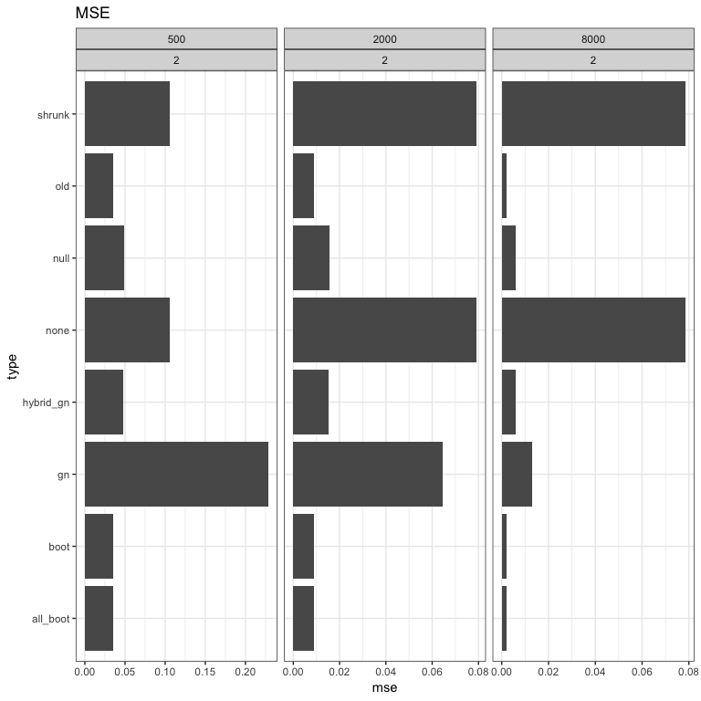

*G**n* comparison simulation results
================

In these simulations, I consider eight different types of possible ways of creating synthetic estimators. When *θ*0 is specified, it is the DR. Lunceford and Davidian is used throughout.

-   *None*: this artificially sets the bias to 0 uniformly for all estimators.
-   *Old*: this is the original way we have always done things, using raw differences: $\\hat{\\Delta} = \\hat{\\theta}\_i - \\hat{\\theta}\_0$.
-   *Shrunk*: this uses the raw differences but scales them by *n*: $\\hat{\\Delta} = n^{-1}(\\hat{\\theta}\_i - \\hat{\\theta}\_0)$.
-   *Boot*: this replaces $\\hat{\\theta}\_i$ with the mean of its bootstrapped versions $\\bar{\\theta}^\*\_i$
-   *All\_boot*: this replaces both quantities with their bootstrapped versions: $\\hat{\\Delta} = \\bar{\\theta}^\*\_i - \\bar{\\theta}^\*\_0$
-   *Gn*: this generates data using a regression forest to predict the outcome and randomly bootstrapping the covariates (and their associated predicted *y*s) and also separately bootstrapping their errors. The bias is estimated by comparing to the regression-forest-based 'true' ATE.
-   *Null*: this is the so-called tree-based method we've been using, where we remove the treatment effect and then bootstrap, and compare to a null ATE.
-   *Hybrid\_gn*: this uses the typical bootstrap, but the bias is estimated by comparing to the regression-forest-based 'true' ATE. It is a hybrid of the previous two methods.

Both models correct
===================

### MSE comparison

|    j|     n| d   | type       |        mse|        bias|        var|
|----:|-----:|:----|:-----------|----------:|-----------:|----------:|
|    1|   500| ld  | none       |  0.0140225|  -0.0218676|  0.0135714|
|    1|   500| ld  | shrunk     |  0.0140225|  -0.0218675|  0.0135714|
|    1|   500| ld  | all\_boot  |  0.0172590|  -0.0192945|  0.0169206|
|    1|   500| ld  | boot       |  0.0173807|  -0.0198110|  0.0170222|
|    1|   500| ld  | old        |  0.0174160|  -0.0200358|  0.0170487|
|    1|   500| ld  | hybrid\_gn |  0.0333398|  -0.1119960|  0.0208384|
|    1|   500| ld  | null       |  0.0334625|  -0.1119640|  0.0209685|
|    1|   500| ld  | gn         |  0.2106878|   0.1895435|  0.1751113|
|    1|  2000| ld  | shrunk     |  0.0041998|  -0.0095173|  0.0041175|
|    1|  2000| ld  | none       |  0.0041998|  -0.0095173|  0.0041175|
|    1|  2000| ld  | old        |  0.0049964|  -0.0062773|  0.0049669|
|    1|  2000| ld  | all\_boot  |  0.0050066|  -0.0061865|  0.0049783|
|    1|  2000| ld  | boot       |  0.0050368|  -0.0061446|  0.0050091|
|    1|  2000| ld  | hybrid\_gn |  0.0121036|  -0.0630403|  0.0081458|
|    1|  2000| ld  | null       |  0.0122747|  -0.0634436|  0.0082662|
|    1|  2000| ld  | gn         |  0.0591538|   0.1121264|  0.0466748|
|    1|  8000| ld  | all\_boot  |  0.0011012|  -0.0018869|  0.0010999|
|    1|  8000| ld  | old        |  0.0011035|  -0.0019369|  0.0011020|
|    1|  8000| ld  | boot       |  0.0011057|  -0.0019679|  0.0011041|
|    1|  8000| ld  | shrunk     |  0.0011213|  -0.0082815|  0.0010548|
|    1|  8000| ld  | none       |  0.0011213|  -0.0082816|  0.0010548|
|    1|  8000| ld  | hybrid\_gn |  0.0051844|  -0.0408313|  0.0035243|
|    1|  8000| ld  | null       |  0.0052229|  -0.0429547|  0.0033846|
|    1|  8000| ld  | gn         |  0.0114459|   0.0465886|  0.0092940|

### Comparing the coefficients

|    j|     n| d   | est         | type       |       bhat|       bvar|
|----:|-----:|:----|:------------|:-----------|----------:|----------:|
|    1|   500| ld  | ate\_dr     | all\_boot  |  0.3073024|  0.0623596|
|    1|   500| ld  | ate\_ipw\_2 | all\_boot  |  0.0131790|  0.0005283|
|    1|   500| ld  | ate\_regr   | all\_boot  |  0.6490450|  0.0598435|
|    1|   500| ld  | ate\_strat  | all\_boot  |  0.0304736|  0.0040716|
|    1|   500| ld  | ate\_dr     | boot       |  0.3094088|  0.0635003|
|    1|   500| ld  | ate\_ipw\_2 | boot       |  0.0130124|  0.0005196|
|    1|   500| ld  | ate\_regr   | boot       |  0.6456200|  0.0608899|
|    1|   500| ld  | ate\_strat  | boot       |  0.0319588|  0.0041948|
|    1|   500| ld  | ate\_dr     | gn         |  0.5493046|  0.2390297|
|    1|   500| ld  | ate\_ipw\_2 | gn         |  0.3228894|  0.2053319|
|    1|   500| ld  | ate\_regr   | gn         |  0.1278060|  0.1008927|
|    1|   500| ld  | ate\_strat  | gn         |  0.0000000|  0.0000000|
|    1|   500| ld  | ate\_dr     | hybrid\_gn |  0.1526213|  0.0469661|
|    1|   500| ld  | ate\_ipw\_2 | hybrid\_gn |  0.0171219|  0.0011910|
|    1|   500| ld  | ate\_regr   | hybrid\_gn |  0.6593791|  0.0582243|
|    1|   500| ld  | ate\_strat  | hybrid\_gn |  0.1708777|  0.0196919|
|    1|   500| ld  | ate\_dr     | none       |  0.1871372|  0.0432350|
|    1|   500| ld  | ate\_ipw\_2 | none       |  0.0155747|  0.0006579|
|    1|   500| ld  | ate\_regr   | none       |  0.7799041|  0.0450245|
|    1|   500| ld  | ate\_strat  | none       |  0.0173840|  0.0007337|
|    1|   500| ld  | ate\_dr     | null       |  0.1524525|  0.0447427|
|    1|   500| ld  | ate\_ipw\_2 | null       |  0.0168124|  0.0011710|
|    1|   500| ld  | ate\_regr   | null       |  0.6584694|  0.0556875|
|    1|   500| ld  | ate\_strat  | null       |  0.1722657|  0.0202359|
|    1|   500| ld  | ate\_dr     | old        |  0.3080084|  0.0621548|
|    1|   500| ld  | ate\_ipw\_2 | old        |  0.0136052|  0.0005475|
|    1|   500| ld  | ate\_regr   | old        |  0.6466837|  0.0596629|
|    1|   500| ld  | ate\_strat  | old        |  0.0317027|  0.0042311|
|    1|   500| ld  | ate\_dr     | shrunk     |  0.1871385|  0.0432350|
|    1|   500| ld  | ate\_ipw\_2 | shrunk     |  0.0155745|  0.0006578|
|    1|   500| ld  | ate\_regr   | shrunk     |  0.7799030|  0.0450245|
|    1|   500| ld  | ate\_strat  | shrunk     |  0.0173839|  0.0007337|
|    1|  2000| ld  | ate\_dr     | all\_boot  |  0.2382960|  0.0613506|
|    1|  2000| ld  | ate\_ipw\_2 | all\_boot  |  0.0076921|  0.0001889|
|    1|  2000| ld  | ate\_regr   | all\_boot  |  0.7304391|  0.0552811|
|    1|  2000| ld  | ate\_strat  | all\_boot  |  0.0235728|  0.0013834|
|    1|  2000| ld  | ate\_dr     | boot       |  0.2396148|  0.0625888|
|    1|  2000| ld  | ate\_ipw\_2 | boot       |  0.0076715|  0.0001896|
|    1|  2000| ld  | ate\_regr   | boot       |  0.7291392|  0.0565684|
|    1|  2000| ld  | ate\_strat  | boot       |  0.0235744|  0.0013480|
|    1|  2000| ld  | ate\_dr     | gn         |  0.3300018|  0.2155923|
|    1|  2000| ld  | ate\_ipw\_2 | gn         |  0.3847353|  0.2308802|
|    1|  2000| ld  | ate\_regr   | gn         |  0.2852629|  0.1984797|
|    1|  2000| ld  | ate\_strat  | gn         |  0.0000000|  0.0000000|
|    1|  2000| ld  | ate\_dr     | hybrid\_gn |  0.1044715|  0.0426871|
|    1|  2000| ld  | ate\_ipw\_2 | hybrid\_gn |  0.0077199|  0.0005833|
|    1|  2000| ld  | ate\_regr   | hybrid\_gn |  0.7622487|  0.0438398|
|    1|  2000| ld  | ate\_strat  | hybrid\_gn |  0.1255599|  0.0154121|
|    1|  2000| ld  | ate\_dr     | none       |  0.0938665|  0.0148842|
|    1|  2000| ld  | ate\_ipw\_2 | none       |  0.0071586|  0.0001749|
|    1|  2000| ld  | ate\_regr   | none       |  0.8837611|  0.0155516|
|    1|  2000| ld  | ate\_strat  | none       |  0.0152138|  0.0006140|
|    1|  2000| ld  | ate\_dr     | null       |  0.1116898|  0.0438501|
|    1|  2000| ld  | ate\_ipw\_2 | null       |  0.0074585|  0.0005355|
|    1|  2000| ld  | ate\_regr   | null       |  0.7548641|  0.0447121|
|    1|  2000| ld  | ate\_strat  | null       |  0.1259875|  0.0159014|
|    1|  2000| ld  | ate\_dr     | old        |  0.2372438|  0.0614541|
|    1|  2000| ld  | ate\_ipw\_2 | old        |  0.0077478|  0.0001867|
|    1|  2000| ld  | ate\_regr   | old        |  0.7312977|  0.0554547|
|    1|  2000| ld  | ate\_strat  | old        |  0.0237107|  0.0014048|
|    1|  2000| ld  | ate\_dr     | shrunk     |  0.0938666|  0.0148842|
|    1|  2000| ld  | ate\_ipw\_2 | shrunk     |  0.0071586|  0.0001749|
|    1|  2000| ld  | ate\_regr   | shrunk     |  0.8837611|  0.0155516|
|    1|  2000| ld  | ate\_strat  | shrunk     |  0.0152137|  0.0006140|
|    1|  8000| ld  | ate\_dr     | all\_boot  |  0.1980371|  0.0596797|
|    1|  8000| ld  | ate\_ipw\_2 | all\_boot  |  0.0073242|  0.0001481|
|    1|  8000| ld  | ate\_regr   | all\_boot  |  0.7808907|  0.0561308|
|    1|  8000| ld  | ate\_strat  | all\_boot  |  0.0137481|  0.0004194|
|    1|  8000| ld  | ate\_dr     | boot       |  0.1977389|  0.0605912|
|    1|  8000| ld  | ate\_ipw\_2 | boot       |  0.0073013|  0.0001502|
|    1|  8000| ld  | ate\_regr   | boot       |  0.7810851|  0.0570949|
|    1|  8000| ld  | ate\_strat  | boot       |  0.0138748|  0.0004319|
|    1|  8000| ld  | ate\_dr     | gn         |  0.1819941|  0.1470528|
|    1|  8000| ld  | ate\_ipw\_2 | gn         |  0.3121772|  0.2104689|
|    1|  8000| ld  | ate\_regr   | gn         |  0.5058288|  0.2445238|
|    1|  8000| ld  | ate\_strat  | gn         |  0.0000000|  0.0000000|
|    1|  8000| ld  | ate\_dr     | hybrid\_gn |  0.1153185|  0.0605110|
|    1|  8000| ld  | ate\_ipw\_2 | hybrid\_gn |  0.0115814|  0.0016387|
|    1|  8000| ld  | ate\_regr   | hybrid\_gn |  0.7870325|  0.0571749|
|    1|  8000| ld  | ate\_strat  | hybrid\_gn |  0.0860675|  0.0094867|
|    1|  8000| ld  | ate\_dr     | none       |  0.0539000|  0.0061686|
|    1|  8000| ld  | ate\_ipw\_2 | none       |  0.0048674|  0.0000814|
|    1|  8000| ld  | ate\_regr   | none       |  0.9234565|  0.0067880|
|    1|  8000| ld  | ate\_strat  | none       |  0.0177761|  0.0007124|
|    1|  8000| ld  | ate\_dr     | null       |  0.1255390|  0.0639318|
|    1|  8000| ld  | ate\_ipw\_2 | null       |  0.0116646|  0.0018116|
|    1|  8000| ld  | ate\_regr   | null       |  0.7741161|  0.0594737|
|    1|  8000| ld  | ate\_strat  | null       |  0.0886803|  0.0094368|
|    1|  8000| ld  | ate\_dr     | old        |  0.1984076|  0.0597661|
|    1|  8000| ld  | ate\_ipw\_2 | old        |  0.0073536|  0.0001493|
|    1|  8000| ld  | ate\_regr   | old        |  0.7803737|  0.0561794|
|    1|  8000| ld  | ate\_strat  | old        |  0.0138651|  0.0004299|
|    1|  8000| ld  | ate\_dr     | shrunk     |  0.0539000|  0.0061686|
|    1|  8000| ld  | ate\_ipw\_2 | shrunk     |  0.0048674|  0.0000814|
|    1|  8000| ld  | ate\_regr   | shrunk     |  0.9234565|  0.0067880|
|    1|  8000| ld  | ate\_strat  | shrunk     |  0.0177761|  0.0007124|

Outcome model incorrect
=======================

### MSE comparison

|    j|     n| d   | type       |        mse|        bias|        var|
|----:|-----:|:----|:-----------|----------:|-----------:|----------:|
|    2|   500| ld  | all\_boot  |  0.0347880|  -0.0470981|  0.0326350|
|    2|   500| ld  | boot       |  0.0350798|  -0.0487708|  0.0327667|
|    2|   500| ld  | old        |  0.0351406|  -0.0476908|  0.0329320|
|    2|   500| ld  | hybrid\_gn |  0.0483227|  -0.1649690|  0.0211502|
|    2|   500| ld  | null       |  0.0488341|  -0.1661164|  0.0212820|
|    2|   500| ld  | shrunk     |  0.1056993|  -0.2792709|  0.0277626|
|    2|   500| ld  | none       |  0.1057060|  -0.2792807|  0.0277638|
|    2|   500| ld  | gn         |  0.2284170|   0.1657133|  0.2013588|
|    2|  2000| ld  | old        |  0.0090267|  -0.0075819|  0.0089872|
|    2|  2000| ld  | all\_boot  |  0.0090393|  -0.0074268|  0.0090021|
|    2|  2000| ld  | boot       |  0.0091335|  -0.0077224|  0.0090921|
|    2|  2000| ld  | hybrid\_gn |  0.0151859|  -0.0828862|  0.0083325|
|    2|  2000| ld  | null       |  0.0154836|  -0.0840615|  0.0084341|
|    2|  2000| ld  | gn         |  0.0644215|   0.1069710|  0.0530848|
|    2|  2000| ld  | shrunk     |  0.0792397|  -0.2596417|  0.0118496|
|    2|  2000| ld  | none       |  0.0792411|  -0.2596441|  0.0118498|
|    2|  8000| ld  | all\_boot  |  0.0021570|  -0.0021775|  0.0021566|
|    2|  8000| ld  | old        |  0.0021591|  -0.0021918|  0.0021586|
|    2|  8000| ld  | boot       |  0.0021686|  -0.0025406|  0.0021665|
|    2|  8000| ld  | hybrid\_gn |  0.0057879|  -0.0485993|  0.0034329|
|    2|  8000| ld  | null       |  0.0059232|  -0.0499665|  0.0034334|
|    2|  8000| ld  | gn         |  0.0129821|   0.0475593|  0.0107417|
|    2|  8000| ld  | shrunk     |  0.0784149|  -0.2713150|  0.0048127|
|    2|  8000| ld  | none       |  0.0784152|  -0.2713157|  0.0048127|

### Comparing the coefficients

|    j|     n| d   | est         | type       |       bhat|       bvar|
|----:|-----:|:----|:------------|:-----------|----------:|----------:|
|    2|   500| ld  | ate\_dr     | all\_boot  |  0.8773410|  0.0149653|
|    2|   500| ld  | ate\_ipw\_2 | all\_boot  |  0.0150666|  0.0015438|
|    2|   500| ld  | ate\_regr   | all\_boot  |  0.1035260|  0.0099696|
|    2|   500| ld  | ate\_strat  | all\_boot  |  0.0040664|  0.0004457|
|    2|   500| ld  | ate\_dr     | boot       |  0.8740461|  0.0153988|
|    2|   500| ld  | ate\_ipw\_2 | boot       |  0.0149929|  0.0015071|
|    2|   500| ld  | ate\_regr   | boot       |  0.1069261|  0.0104343|
|    2|   500| ld  | ate\_strat  | boot       |  0.0040348|  0.0004284|
|    2|   500| ld  | ate\_dr     | gn         |  0.6548356|  0.2148472|
|    2|   500| ld  | ate\_ipw\_2 | gn         |  0.3451644|  0.2148472|
|    2|   500| ld  | ate\_regr   | gn         |  0.0000000|  0.0000000|
|    2|   500| ld  | ate\_strat  | gn         |  0.0000000|  0.0000000|
|    2|   500| ld  | ate\_dr     | hybrid\_gn |  0.6821530|  0.0468527|
|    2|   500| ld  | ate\_ipw\_2 | hybrid\_gn |  0.0140388|  0.0012824|
|    2|   500| ld  | ate\_regr   | hybrid\_gn |  0.2715863|  0.0369305|
|    2|   500| ld  | ate\_strat  | hybrid\_gn |  0.0322219|  0.0041702|
|    2|   500| ld  | ate\_dr     | none       |  0.4838636|  0.0451130|
|    2|   500| ld  | ate\_ipw\_2 | none       |  0.0107654|  0.0007751|
|    2|   500| ld  | ate\_regr   | none       |  0.4356653|  0.0365312|
|    2|   500| ld  | ate\_strat  | none       |  0.0697056|  0.0051342|
|    2|   500| ld  | ate\_dr     | null       |  0.6804156|  0.0472119|
|    2|   500| ld  | ate\_ipw\_2 | null       |  0.0135263|  0.0011892|
|    2|   500| ld  | ate\_regr   | null       |  0.2722707|  0.0367273|
|    2|   500| ld  | ate\_strat  | null       |  0.0337873|  0.0044775|
|    2|   500| ld  | ate\_dr     | old        |  0.8708853|  0.0177662|
|    2|   500| ld  | ate\_ipw\_2 | old        |  0.0163894|  0.0016922|
|    2|   500| ld  | ate\_regr   | old        |  0.1036556|  0.0102004|
|    2|   500| ld  | ate\_strat  | old        |  0.0090697|  0.0025512|
|    2|   500| ld  | ate\_dr     | shrunk     |  0.4838791|  0.0451113|
|    2|   500| ld  | ate\_ipw\_2 | shrunk     |  0.0107655|  0.0007751|
|    2|   500| ld  | ate\_regr   | shrunk     |  0.4356564|  0.0365304|
|    2|   500| ld  | ate\_strat  | shrunk     |  0.0696989|  0.0051337|
|    2|  2000| ld  | ate\_dr     | all\_boot  |  0.9694612|  0.0011641|
|    2|  2000| ld  | ate\_ipw\_2 | all\_boot  |  0.0058532|  0.0004485|
|    2|  2000| ld  | ate\_regr   | all\_boot  |  0.0238794|  0.0003551|
|    2|  2000| ld  | ate\_strat  | all\_boot  |  0.0008062|  0.0001250|
|    2|  2000| ld  | ate\_dr     | boot       |  0.9690923|  0.0013771|
|    2|  2000| ld  | ate\_ipw\_2 | boot       |  0.0058805|  0.0004464|
|    2|  2000| ld  | ate\_regr   | boot       |  0.0242188|  0.0005783|
|    2|  2000| ld  | ate\_strat  | boot       |  0.0008085|  0.0001213|
|    2|  2000| ld  | ate\_dr     | gn         |  0.5631526|  0.2427950|
|    2|  2000| ld  | ate\_ipw\_2 | gn         |  0.4368474|  0.2427950|
|    2|  2000| ld  | ate\_regr   | gn         |  0.0000000|  0.0000000|
|    2|  2000| ld  | ate\_strat  | gn         |  0.0000000|  0.0000000|
|    2|  2000| ld  | ate\_dr     | hybrid\_gn |  0.8208599|  0.0246966|
|    2|  2000| ld  | ate\_ipw\_2 | hybrid\_gn |  0.0082484|  0.0009468|
|    2|  2000| ld  | ate\_regr   | hybrid\_gn |  0.1628244|  0.0218468|
|    2|  2000| ld  | ate\_strat  | hybrid\_gn |  0.0080672|  0.0018136|
|    2|  2000| ld  | ate\_dr     | none       |  0.4748265|  0.0306402|
|    2|  2000| ld  | ate\_ipw\_2 | none       |  0.0022731|  0.0001375|
|    2|  2000| ld  | ate\_regr   | none       |  0.4424569|  0.0184903|
|    2|  2000| ld  | ate\_strat  | none       |  0.0804434|  0.0057878|
|    2|  2000| ld  | ate\_dr     | null       |  0.8190093|  0.0252234|
|    2|  2000| ld  | ate\_ipw\_2 | null       |  0.0077410|  0.0008517|
|    2|  2000| ld  | ate\_regr   | null       |  0.1645968|  0.0220434|
|    2|  2000| ld  | ate\_strat  | null       |  0.0086528|  0.0018865|
|    2|  2000| ld  | ate\_dr     | old        |  0.9689264|  0.0012361|
|    2|  2000| ld  | ate\_ipw\_2 | old        |  0.0060248|  0.0004524|
|    2|  2000| ld  | ate\_regr   | old        |  0.0239147|  0.0003763|
|    2|  2000| ld  | ate\_strat  | old        |  0.0011340|  0.0001622|
|    2|  2000| ld  | ate\_dr     | shrunk     |  0.4748311|  0.0306399|
|    2|  2000| ld  | ate\_ipw\_2 | shrunk     |  0.0022732|  0.0001375|
|    2|  2000| ld  | ate\_regr   | shrunk     |  0.4424546|  0.0184903|
|    2|  2000| ld  | ate\_strat  | shrunk     |  0.0804412|  0.0057876|
|    2|  8000| ld  | ate\_dr     | all\_boot  |  0.9923852|  0.0002637|
|    2|  8000| ld  | ate\_ipw\_2 | all\_boot  |  0.0012642|  0.0001070|
|    2|  8000| ld  | ate\_regr   | all\_boot  |  0.0063506|  0.0000481|
|    2|  8000| ld  | ate\_strat  | all\_boot  |  0.0000000|  0.0000000|
|    2|  8000| ld  | ate\_dr     | boot       |  0.9915673|  0.0003141|
|    2|  8000| ld  | ate\_ipw\_2 | boot       |  0.0012844|  0.0001054|
|    2|  8000| ld  | ate\_regr   | boot       |  0.0071482|  0.0000859|
|    2|  8000| ld  | ate\_strat  | boot       |  0.0000000|  0.0000000|
|    2|  8000| ld  | ate\_dr     | gn         |  0.5416889|  0.2461844|
|    2|  8000| ld  | ate\_ipw\_2 | gn         |  0.4583111|  0.2461844|
|    2|  8000| ld  | ate\_regr   | gn         |  0.0000000|  0.0000000|
|    2|  8000| ld  | ate\_strat  | gn         |  0.0000000|  0.0000000|
|    2|  8000| ld  | ate\_dr     | hybrid\_gn |  0.8877369|  0.0131793|
|    2|  8000| ld  | ate\_ipw\_2 | hybrid\_gn |  0.0096588|  0.0017507|
|    2|  8000| ld  | ate\_regr   | hybrid\_gn |  0.1020049|  0.0129925|
|    2|  8000| ld  | ate\_strat  | hybrid\_gn |  0.0005994|  0.0000342|
|    2|  8000| ld  | ate\_dr     | none       |  0.4414535|  0.0171964|
|    2|  8000| ld  | ate\_ipw\_2 | none       |  0.0003758|  0.0000158|
|    2|  8000| ld  | ate\_regr   | none       |  0.4552394|  0.0084049|
|    2|  8000| ld  | ate\_strat  | none       |  0.1029312|  0.0057864|
|    2|  8000| ld  | ate\_dr     | null       |  0.8856864|  0.0133611|
|    2|  8000| ld  | ate\_ipw\_2 | null       |  0.0090705|  0.0016877|
|    2|  8000| ld  | ate\_regr   | null       |  0.1043032|  0.0130248|
|    2|  8000| ld  | ate\_strat  | null       |  0.0009399|  0.0000527|
|    2|  8000| ld  | ate\_dr     | old        |  0.9923344|  0.0002853|
|    2|  8000| ld  | ate\_ipw\_2 | old        |  0.0012721|  0.0001079|
|    2|  8000| ld  | ate\_regr   | old        |  0.0063935|  0.0000563|
|    2|  8000| ld  | ate\_strat  | old        |  0.0000000|  0.0000000|
|    2|  8000| ld  | ate\_dr     | shrunk     |  0.4414548|  0.0171964|
|    2|  8000| ld  | ate\_ipw\_2 | shrunk     |  0.0003758|  0.0000158|
|    2|  8000| ld  | ate\_regr   | shrunk     |  0.4552388|  0.0084049|
|    2|  8000| ld  | ate\_strat  | shrunk     |  0.1029305|  0.0057864|
