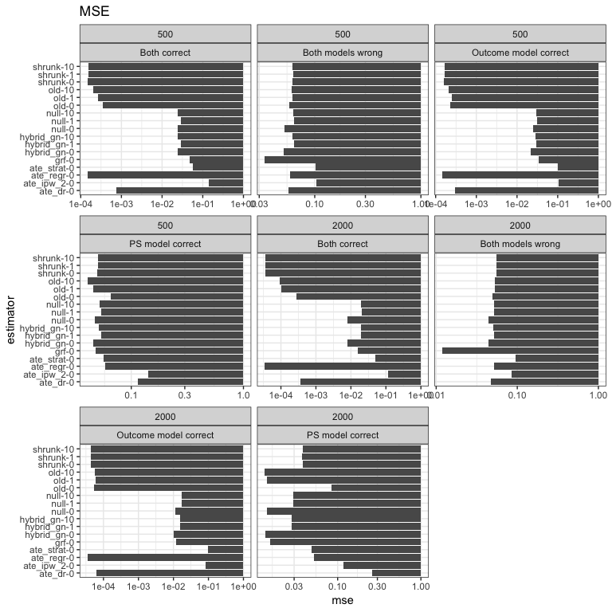
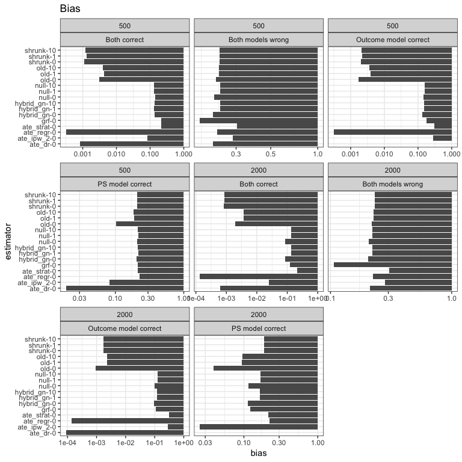
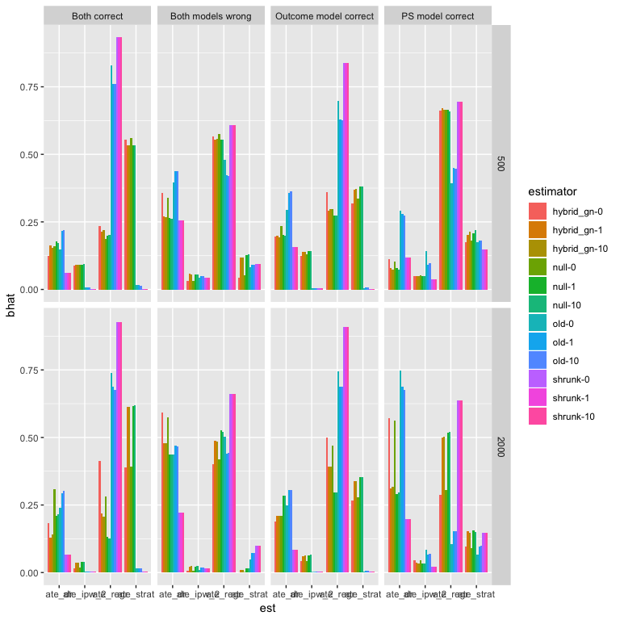
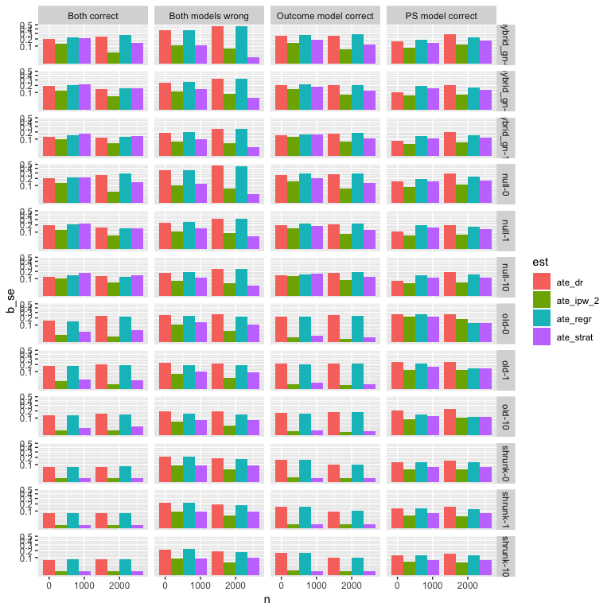

Split-sample sims
================

In these simulations, I consider a set of different synthetic estimators. When *θ*0 is specified, it is the DR. Leacy and Stuart is used throughout. The synthetic estimators are as follows:

-   *Old*: this is the original way we have always done things, using raw differences: $\\hat{\\Delta} = \\hat{\\theta}\_i - \\hat{\\theta}\_0$.
-   *Shrunk*: this uses the raw differences but scales them by *n*: $\\hat{\\Delta} = n^{-1}(\\hat{\\theta}\_i - \\hat{\\theta}\_0)$.
-   *Null*: this is the so-called tree-based method we've been using, where we remove the estimated treatment effect (according to causal forest) and then bootstrap, and compare to a null ATE.
-   *Hybrid\_gn*: this uses the typical bootstrap, but the bias is estimated by comparing to the causal forest ATE.

We also compare to the four candidate estimators: DR, regression, IPW, and stratifying on the PS. And we compare to the causal forest estimator, even though it's not part of the composite.

Finally, we consider multiple split-sample approaches. The number following the synthetic estimator indicates the number of splits used to estimate it. A zero indicates that no splits were used - standard synthetic estimator. A one indicates the original split-sample approach, where we fit on two halves. A ten indicates that we repeat the split-sample (and fit on each half) ten times.

Leacy and Stuart results
========================

Note: I used a log-scale on these results to make clear the differences between the best approaches.

| j\_d                  |     n| d   | estimator     |        mse|        bias|        var|
|:----------------------|-----:|:----|:--------------|----------:|-----------:|----------:|
| Both correct          |   500| ls  | ate\_regr-0   |  0.0001459|   0.0003180|  0.0001461|
| Outcome model correct |   500| ls  | ate\_regr-0   |  0.0001459|   0.0003180|  0.0001461|
| Both correct          |   500| ls  | shrunk-0      |  0.0001510|   0.0011107|  0.0001500|
| Both correct          |   500| ls  | shrunk-10     |  0.0001527|   0.0012009|  0.0001516|
| Both correct          |   500| ls  | shrunk-1      |  0.0001565|   0.0013100|  0.0001551|
| Outcome model correct |   500| ls  | shrunk-0      |  0.0001624|   0.0020143|  0.0001587|
| Outcome model correct |   500| ls  | shrunk-10     |  0.0001649|   0.0020862|  0.0001609|
| Outcome model correct |   500| ls  | shrunk-1      |  0.0001699|   0.0021764|  0.0001655|
| Outcome model correct |   500| ls  | old-10        |  0.0002045|   0.0035955|  0.0001920|
| Both correct          |   500| ls  | old-10        |  0.0002076|   0.0040400|  0.0001916|
| Outcome model correct |   500| ls  | old-0         |  0.0002244|   0.0016878|  0.0002220|
| Outcome model correct |   500| ls  | old-1         |  0.0002442|   0.0039364|  0.0002292|
| Both correct          |   500| ls  | old-1         |  0.0002684|   0.0042841|  0.0002506|
| Outcome model correct |   500| ls  | ate\_dr-0     |  0.0002951|  -0.0002303|  0.0002956|
| Both correct          |   500| ls  | old-0         |  0.0003413|   0.0030423|  0.0003327|
| Both correct          |   500| ls  | ate\_dr-0     |  0.0007516|   0.0008446|  0.0007524|
| Outcome model correct |   500| ls  | hybrid\_gn-0  |  0.0219939|   0.1365016|  0.0033679|
| Both correct          |   500| ls  | hybrid\_gn-0  |  0.0237264|   0.1374133|  0.0048537|
| Outcome model correct |   500| ls  | null-0        |  0.0243903|   0.1437293|  0.0037397|
| Both correct          |   500| ls  | null-0        |  0.0245138|   0.1396913|  0.0050102|
| Both correct          |   500| ls  | null-10       |  0.0245326|   0.1332871|  0.0067807|
| Both correct          |   500| ls  | hybrid\_gn-10 |  0.0246351|   0.1336538|  0.0067853|
| Outcome model correct |   500| ls  | hybrid\_gn-10 |  0.0282461|   0.1534177|  0.0047186|
| Both correct          |   500| ls  | null-1        |  0.0287724|   0.1318066|  0.0114222|
| Both correct          |   500| ls  | hybrid\_gn-1  |  0.0287897|   0.1321169|  0.0113575|
| Outcome model correct |   500| ls  | hybrid\_gn-1  |  0.0295513|   0.1530999|  0.0061239|
| Outcome model correct |   500| ls  | null-10       |  0.0299625|   0.1581951|  0.0049467|
| Outcome model correct |   500| ls  | null-1        |  0.0313524|   0.1581508|  0.0063535|
| Outcome model correct |   500| ls  | grf-0         |  0.0337780|   0.1756700|  0.0029239|
| Both models wrong     |   500| ls  | grf-0         |  0.0338962|   0.1760222|  0.0029182|
| PS model correct      |   500| ls  | old-10        |  0.0406261|   0.1847925|  0.0064908|
| PS model correct      |   500| ls  | old-1         |  0.0459520|   0.1878813|  0.0106740|
| PS model correct      |   500| ls  | hybrid\_gn-0  |  0.0460879|   0.2051058|  0.0040276|
| PS model correct      |   500| ls  | null-0        |  0.0474328|   0.2079431|  0.0042009|
| Both correct          |   500| ls  | grf-0         |  0.0477841|   0.2114479|  0.0030801|
| PS model correct      |   500| ls  | grf-0         |  0.0478185|   0.2115308|  0.0030794|
| PS model correct      |   500| ls  | shrunk-0      |  0.0497208|   0.2083800|  0.0063112|
| PS model correct      |   500| ls  | shrunk-10     |  0.0504053|   0.2100693|  0.0062888|
| Both models wrong     |   500| ls  | hybrid\_gn-0  |  0.0507267|   0.2136238|  0.0051018|
| PS model correct      |   500| ls  | shrunk-1      |  0.0508322|   0.2089105|  0.0072030|
| PS model correct      |   500| ls  | hybrid\_gn-10 |  0.0517014|   0.2138828|  0.0059675|
| Both models wrong     |   500| ls  | null-0        |  0.0517647|   0.2161136|  0.0050697|
| PS model correct      |   500| ls  | null-10       |  0.0517900|   0.2139407|  0.0060314|
| PS model correct      |   500| ls  | hybrid\_gn-1  |  0.0535881|   0.2154325|  0.0071913|
| PS model correct      |   500| ls  | null-1        |  0.0535882|   0.2152322|  0.0072778|
| Both models wrong     |   500| ls  | ate\_dr-0     |  0.0565212|   0.2134898|  0.0109653|
| Both correct          |   500| ls  | ate\_strat-0  |  0.0568946|   0.2114598|  0.0122038|
| PS model correct      |   500| ls  | ate\_strat-0  |  0.0568946|   0.2114598|  0.0122038|
| Both models wrong     |   500| ls  | old-0         |  0.0579431|   0.2236201|  0.0079531|
| Both models wrong     |   500| ls  | ate\_regr-0   |  0.0583673|   0.2267714|  0.0069560|
| PS model correct      |   500| ls  | ate\_regr-0   |  0.0583673|   0.2267714|  0.0069560|
| Both models wrong     |   500| ls  | old-10        |  0.0607796|   0.2324109|  0.0067784|
| Both models wrong     |   500| ls  | hybrid\_gn-10 |  0.0618065|   0.2361579|  0.0060481|
| Both models wrong     |   500| ls  | old-1         |  0.0618364|   0.2324326|  0.0078272|
| Both models wrong     |   500| ls  | shrunk-10     |  0.0619862|   0.2348506|  0.0068451|
| Both models wrong     |   500| ls  | shrunk-0      |  0.0621878|   0.2352827|  0.0068436|
| Both models wrong     |   500| ls  | shrunk-1      |  0.0622688|   0.2342391|  0.0074157|
| Both models wrong     |   500| ls  | null-10       |  0.0622741|   0.2371187|  0.0060609|
| Both models wrong     |   500| ls  | hybrid\_gn-1  |  0.0634173|   0.2369602|  0.0072817|
| Both models wrong     |   500| ls  | null-1        |  0.0637617|   0.2376939|  0.0072778|
| PS model correct      |   500| ls  | old-0         |  0.0661481|   0.1031961|  0.0556099|
| Both models wrong     |   500| ls  | ate\_strat-0  |  0.1025978|   0.3033839|  0.0105772|
| Outcome model correct |   500| ls  | ate\_strat-0  |  0.1025978|   0.3033839|  0.0105772|
| Both models wrong     |   500| ls  | ate\_ipw\_2-0 |  0.1030700|   0.2862171|  0.0211922|
| Outcome model correct |   500| ls  | ate\_ipw\_2-0 |  0.1030700|   0.2862171|  0.0211922|
| PS model correct      |   500| ls  | ate\_dr-0     |  0.1149685|   0.0189954|  0.1148373|
| Both correct          |   500| ls  | ate\_ipw\_2-0 |  0.1405676|   0.0828691|  0.1339683|
| PS model correct      |   500| ls  | ate\_ipw\_2-0 |  0.1405676|   0.0828691|  0.1339683|
| Both correct          |  2000| ls  | ate\_regr-0   |  0.0000348|   0.0001359|  0.0000348|
| Outcome model correct |  2000| ls  | ate\_regr-0   |  0.0000348|   0.0001359|  0.0000348|
| Both correct          |  2000| ls  | shrunk-1      |  0.0000362|   0.0008608|  0.0000356|
| Both correct          |  2000| ls  | shrunk-0      |  0.0000363|   0.0008301|  0.0000357|
| Both correct          |  2000| ls  | shrunk-10     |  0.0000364|   0.0008507|  0.0000357|
| Outcome model correct |  2000| ls  | shrunk-1      |  0.0000434|   0.0017502|  0.0000404|
| Outcome model correct |  2000| ls  | shrunk-0      |  0.0000435|   0.0017312|  0.0000406|
| Outcome model correct |  2000| ls  | shrunk-10     |  0.0000436|   0.0017250|  0.0000407|
| Outcome model correct |  2000| ls  | old-0         |  0.0000552|   0.0009092|  0.0000545|
| Outcome model correct |  2000| ls  | old-10        |  0.0000555|   0.0023502|  0.0000501|
| Outcome model correct |  2000| ls  | old-1         |  0.0000583|   0.0022631|  0.0000533|
| Outcome model correct |  2000| ls  | ate\_dr-0     |  0.0000630|   0.0000888|  0.0000631|
| Both correct          |  2000| ls  | old-10        |  0.0000932|   0.0037379|  0.0000794|
| Both correct          |  2000| ls  | old-1         |  0.0001021|   0.0036095|  0.0000893|
| Both correct          |  2000| ls  | old-0         |  0.0002761|   0.0019784|  0.0002727|
| Both correct          |  2000| ls  | ate\_dr-0     |  0.0003552|   0.0006286|  0.0003555|
| Both correct          |  2000| ls  | hybrid\_gn-0  |  0.0078202|   0.0840725|  0.0007535|
| Both correct          |  2000| ls  | null-0        |  0.0079785|   0.0847492|  0.0007977|
| Outcome model correct |  2000| ls  | hybrid\_gn-0  |  0.0102181|   0.0949023|  0.0012141|
| Outcome model correct |  2000| ls  | null-0        |  0.0110938|   0.0978058|  0.0015309|
| Both models wrong     |  2000| ls  | grf-0         |  0.0119095|   0.1066914|  0.0005275|
| Outcome model correct |  2000| ls  | grf-0         |  0.0119805|   0.1070002|  0.0005325|
| PS model correct      |  2000| ls  | old-10        |  0.0133569|   0.0957859|  0.0041903|
| PS model correct      |  2000| ls  | hybrid\_gn-0  |  0.0136239|   0.1122109|  0.0010347|
| PS model correct      |  2000| ls  | null-0        |  0.0141401|   0.1142376|  0.0010921|
| PS model correct      |  2000| ls  | old-1         |  0.0141590|   0.0939950|  0.0053346|
| PS model correct      |  2000| ls  | grf-0         |  0.0155012|   0.1221704|  0.0005767|
| Both correct          |  2000| ls  | grf-0         |  0.0155199|   0.1222568|  0.0005743|
| Outcome model correct |  2000| ls  | hybrid\_gn-10 |  0.0155815|   0.1214224|  0.0008398|
| Outcome model correct |  2000| ls  | hybrid\_gn-1  |  0.0156437|   0.1209617|  0.0010140|
| Outcome model correct |  2000| ls  | null-10       |  0.0172012|   0.1274061|  0.0009708|
| Outcome model correct |  2000| ls  | null-1        |  0.0172777|   0.1268807|  0.0011814|
| Both correct          |  2000| ls  | hybrid\_gn-10 |  0.0193119|   0.1354102|  0.0009779|
| Both correct          |  2000| ls  | hybrid\_gn-1  |  0.0195967|   0.1350528|  0.0013601|
| Both correct          |  2000| ls  | null-10       |  0.0196109|   0.1364239|  0.0010014|
| Both correct          |  2000| ls  | null-1        |  0.0199266|   0.1361071|  0.0014043|
| PS model correct      |  2000| ls  | hybrid\_gn-10 |  0.0278449|   0.1636871|  0.0010535|
| PS model correct      |  2000| ls  | hybrid\_gn-1  |  0.0282675|   0.1639883|  0.0013781|
| PS model correct      |  2000| ls  | null-10       |  0.0291958|   0.1675953|  0.0011099|
| PS model correct      |  2000| ls  | null-1        |  0.0295204|   0.1676574|  0.0014142|
| PS model correct      |  2000| ls  | shrunk-1      |  0.0375414|   0.1881008|  0.0021639|
| PS model correct      |  2000| ls  | shrunk-10     |  0.0378270|   0.1890472|  0.0020924|
| PS model correct      |  2000| ls  | shrunk-0      |  0.0378468|   0.1890345|  0.0021170|
| Both models wrong     |  2000| ls  | hybrid\_gn-0  |  0.0442690|   0.2055960|  0.0020033|
| Both models wrong     |  2000| ls  | null-0        |  0.0444828|   0.2061159|  0.0020030|
| Both models wrong     |  2000| ls  | ate\_dr-0     |  0.0471849|   0.2105512|  0.0028588|
| Both correct          |  2000| ls  | ate\_strat-0  |  0.0486622|   0.2127534|  0.0034050|
| PS model correct      |  2000| ls  | ate\_strat-0  |  0.0486622|   0.2127534|  0.0034050|
| Both models wrong     |  2000| ls  | old-0         |  0.0497744|   0.2177950|  0.0023444|
| Both models wrong     |  2000| ls  | hybrid\_gn-10 |  0.0511094|   0.2215941|  0.0020094|
| Both models wrong     |  2000| ls  | hybrid\_gn-1  |  0.0513817|   0.2212012|  0.0024567|
| Both models wrong     |  2000| ls  | null-10       |  0.0514165|   0.2224262|  0.0019470|
| Both models wrong     |  2000| ls  | null-1        |  0.0517526|   0.2221274|  0.0024168|
| Both models wrong     |  2000| ls  | ate\_regr-0   |  0.0518647|   0.2236967|  0.0018282|
| PS model correct      |  2000| ls  | ate\_regr-0   |  0.0518647|   0.2236967|  0.0018282|
| Both models wrong     |  2000| ls  | old-10        |  0.0533278|   0.2264794|  0.0020389|
| Both models wrong     |  2000| ls  | old-1         |  0.0533523|   0.2259405|  0.0023078|
| Both models wrong     |  2000| ls  | shrunk-1      |  0.0551678|   0.2308198|  0.0018937|
| Both models wrong     |  2000| ls  | shrunk-10     |  0.0552507|   0.2310523|  0.0018693|
| Both models wrong     |  2000| ls  | shrunk-0      |  0.0554188|   0.2313987|  0.0018772|
| PS model correct      |  2000| ls  | old-0         |  0.0845187|   0.0388863|  0.0831729|
| Both models wrong     |  2000| ls  | ate\_ipw\_2-0 |  0.0849918|   0.2831554|  0.0048244|
| Outcome model correct |  2000| ls  | ate\_ipw\_2-0 |  0.0849918|   0.2831554|  0.0048244|
| Both models wrong     |  2000| ls  | ate\_strat-0  |  0.0955744|   0.3050450|  0.0025270|
| Outcome model correct |  2000| ls  | ate\_strat-0  |  0.0955744|   0.3050450|  0.0025270|
| Both correct          |  2000| ls  | ate\_ipw\_2-0 |  0.1167775|   0.0254095|  0.1163645|
| PS model correct      |  2000| ls  | ate\_ipw\_2-0 |  0.1167775|   0.0254095|  0.1163645|
| PS model correct      |  2000| ls  | ate\_dr-0     |  0.2616693|  -0.0024377|  0.2621877|

### Comparing the coefficients

| j\_d                  |     n| d   | est         | estimator     |       bhat|       bvar|      b\_se|
|:----------------------|-----:|:----|:------------|:--------------|----------:|----------:|----------:|
| Both correct          |   500| ls  | ate\_dr     | hybrid\_gn-0  |  0.1247146|  0.0372887|  0.1931029|
| Both correct          |  2000| ls  | ate\_dr     | hybrid\_gn-0  |  0.1825665|  0.0591626|  0.2432336|
| Both correct          |   500| ls  | ate\_ipw\_2 | hybrid\_gn-0  |  0.0869563|  0.0173731|  0.1318069|
| Both correct          |  2000| ls  | ate\_ipw\_2 | hybrid\_gn-0  |  0.0167927|  0.0016664|  0.0408221|
| Both correct          |   500| ls  | ate\_regr   | hybrid\_gn-0  |  0.2347009|  0.0519127|  0.2278435|
| Both correct          |  2000| ls  | ate\_regr   | hybrid\_gn-0  |  0.4116803|  0.0698178|  0.2642305|
| Both correct          |   500| ls  | ate\_strat  | hybrid\_gn-0  |  0.5536282|  0.0473362|  0.2175689|
| Both correct          |  2000| ls  | ate\_strat  | hybrid\_gn-0  |  0.3889605|  0.0199878|  0.1413781|
| Both correct          |   500| ls  | ate\_dr     | hybrid\_gn-1  |  0.1642585|  0.0374593|  0.1935442|
| Both correct          |  2000| ls  | ate\_dr     | hybrid\_gn-1  |  0.1303091|  0.0208181|  0.1442848|
| Both correct          |   500| ls  | ate\_ipw\_2 | hybrid\_gn-1  |  0.0906468|  0.0155306|  0.1246220|
| Both correct          |  2000| ls  | ate\_ipw\_2 | hybrid\_gn-1  |  0.0375916|  0.0041360|  0.0643119|
| Both correct          |   500| ls  | ate\_regr   | hybrid\_gn-1  |  0.2122599|  0.0435797|  0.2087575|
| Both correct          |  2000| ls  | ate\_regr   | hybrid\_gn-1  |  0.2192566|  0.0243920|  0.1561795|
| Both correct          |   500| ls  | ate\_strat  | hybrid\_gn-1  |  0.5328347|  0.0502991|  0.2242747|
| Both correct          |  2000| ls  | ate\_strat  | hybrid\_gn-1  |  0.6128427|  0.0229857|  0.1516103|
| Both correct          |   500| ls  | ate\_dr     | hybrid\_gn-10 |  0.1552541|  0.0150642|  0.1227361|
| Both correct          |  2000| ls  | ate\_dr     | hybrid\_gn-10 |  0.1411448|  0.0146388|  0.1209907|
| Both correct          |   500| ls  | ate\_ipw\_2 | hybrid\_gn-10 |  0.0922985|  0.0101439|  0.1007168|
| Both correct          |  2000| ls  | ate\_ipw\_2 | hybrid\_gn-10 |  0.0379792|  0.0031743|  0.0563406|
| Both correct          |   500| ls  | ate\_regr   | hybrid\_gn-10 |  0.2190355|  0.0220648|  0.1485422|
| Both correct          |  2000| ls  | ate\_regr   | hybrid\_gn-10 |  0.2064969|  0.0171427|  0.1309302|
| Both correct          |   500| ls  | ate\_strat  | hybrid\_gn-10 |  0.5334119|  0.0293766|  0.1713961|
| Both correct          |  2000| ls  | ate\_strat  | hybrid\_gn-10 |  0.6143791|  0.0182283|  0.1350123|
| Both correct          |   500| ls  | ate\_dr     | null-0        |  0.1604557|  0.0410892|  0.2027047|
| Both correct          |  2000| ls  | ate\_dr     | null-0        |  0.3098101|  0.0704331|  0.2653923|
| Both correct          |   500| ls  | ate\_ipw\_2 | null-0        |  0.0910871|  0.0185933|  0.1363574|
| Both correct          |  2000| ls  | ate\_ipw\_2 | null-0        |  0.0176353|  0.0017518|  0.0418542|
| Both correct          |   500| ls  | ate\_regr   | null-0        |  0.1870157|  0.0485481|  0.2203363|
| Both correct          |  2000| ls  | ate\_regr   | null-0        |  0.2800738|  0.0849211|  0.2914122|
| Both correct          |   500| ls  | ate\_strat  | null-0        |  0.5614415|  0.0488861|  0.2211019|
| Both correct          |  2000| ls  | ate\_strat  | null-0        |  0.3924808|  0.0211994|  0.1456002|
| Both correct          |   500| ls  | ate\_dr     | null-1        |  0.1785265|  0.0380262|  0.1950031|
| Both correct          |  2000| ls  | ate\_dr     | null-1        |  0.2109641|  0.0253646|  0.1592625|
| Both correct          |   500| ls  | ate\_ipw\_2 | null-1        |  0.0906584|  0.0156761|  0.1252042|
| Both correct          |  2000| ls  | ate\_ipw\_2 | null-1        |  0.0392847|  0.0044526|  0.0667280|
| Both correct          |   500| ls  | ate\_regr   | null-1        |  0.1985147|  0.0419366|  0.2047842|
| Both correct          |  2000| ls  | ate\_regr   | null-1        |  0.1329027|  0.0212281|  0.1456985|
| Both correct          |   500| ls  | ate\_strat  | null-1        |  0.5323004|  0.0506008|  0.2249461|
| Both correct          |  2000| ls  | ate\_strat  | null-1        |  0.6168485|  0.0236597|  0.1538171|
| Both correct          |   500| ls  | ate\_dr     | null-10       |  0.1717222|  0.0148671|  0.1219307|
| Both correct          |  2000| ls  | ate\_dr     | null-10       |  0.2157802|  0.0159668|  0.1263596|
| Both correct          |   500| ls  | ate\_ipw\_2 | null-10       |  0.0927801|  0.0103280|  0.1016267|
| Both correct          |  2000| ls  | ate\_ipw\_2 | null-10       |  0.0396619|  0.0033713|  0.0580626|
| Both correct          |   500| ls  | ate\_regr   | null-10       |  0.2031020|  0.0212783|  0.1458710|
| Both correct          |  2000| ls  | ate\_regr   | null-10       |  0.1258961|  0.0139514|  0.1181162|
| Both correct          |   500| ls  | ate\_strat  | null-10       |  0.5323957|  0.0295651|  0.1719450|
| Both correct          |  2000| ls  | ate\_strat  | null-10       |  0.6186619|  0.0188287|  0.1372178|
| Both correct          |   500| ls  | ate\_dr     | old-0         |  0.1493319|  0.0234033|  0.1529814|
| Both correct          |  2000| ls  | ate\_dr     | old-0         |  0.2408723|  0.0531017|  0.2304380|
| Both correct          |   500| ls  | ate\_ipw\_2 | old-0         |  0.0064089|  0.0003443|  0.0185558|
| Both correct          |  2000| ls  | ate\_ipw\_2 | old-0         |  0.0032668|  0.0001143|  0.0106892|
| Both correct          |   500| ls  | ate\_regr   | old-0         |  0.8283538|  0.0222563|  0.1491856|
| Both correct          |  2000| ls  | ate\_regr   | old-0         |  0.7399650|  0.0507985|  0.2253853|
| Both correct          |   500| ls  | ate\_strat  | old-0         |  0.0159054|  0.0015933|  0.0399164|
| Both correct          |  2000| ls  | ate\_strat  | old-0         |  0.0158959|  0.0026350|  0.0513321|
| Both correct          |   500| ls  | ate\_dr     | old-1         |  0.2169715|  0.0327535|  0.1809794|
| Both correct          |  2000| ls  | ate\_dr     | old-1         |  0.2945966|  0.0384703|  0.1961386|
| Both correct          |   500| ls  | ate\_ipw\_2 | old-1         |  0.0073782|  0.0004063|  0.0201581|
| Both correct          |  2000| ls  | ate\_ipw\_2 | old-1         |  0.0037653|  0.0000417|  0.0064566|
| Both correct          |   500| ls  | ate\_regr   | old-1         |  0.7600980|  0.0309456|  0.1759135|
| Both correct          |  2000| ls  | ate\_regr   | old-1         |  0.6863817|  0.0363771|  0.1907279|
| Both correct          |   500| ls  | ate\_strat  | old-1         |  0.0155523|  0.0007814|  0.0279538|
| Both correct          |  2000| ls  | ate\_strat  | old-1         |  0.0152564|  0.0006466|  0.0254280|
| Both correct          |   500| ls  | ate\_dr     | old-10        |  0.2191482|  0.0190511|  0.1380259|
| Both correct          |  2000| ls  | ate\_dr     | old-10        |  0.3037712|  0.0248182|  0.1575379|
| Both correct          |   500| ls  | ate\_ipw\_2 | old-10        |  0.0065525|  0.0000588|  0.0076666|
| Both correct          |  2000| ls  | ate\_ipw\_2 | old-10        |  0.0041872|  0.0000571|  0.0075575|
| Both correct          |   500| ls  | ate\_regr   | old-10        |  0.7598660|  0.0168404|  0.1297705|
| Both correct          |  2000| ls  | ate\_regr   | old-10        |  0.6760970|  0.0218940|  0.1479663|
| Both correct          |   500| ls  | ate\_strat  | old-10        |  0.0144333|  0.0003390|  0.0184128|
| Both correct          |  2000| ls  | ate\_strat  | old-10        |  0.0159446|  0.0006835|  0.0261437|
| Both correct          |   500| ls  | ate\_dr     | shrunk-0      |  0.0625496|  0.0058473|  0.0764674|
| Both correct          |  2000| ls  | ate\_dr     | shrunk-0      |  0.0677756|  0.0060434|  0.0777391|
| Both correct          |   500| ls  | ate\_ipw\_2 | shrunk-0      |  0.0021887|  0.0000173|  0.0041630|
| Both correct          |  2000| ls  | ate\_ipw\_2 | shrunk-0      |  0.0022992|  0.0000153|  0.0039159|
| Both correct          |   500| ls  | ate\_regr   | shrunk-0      |  0.9326932|  0.0059933|  0.0774167|
| Both correct          |  2000| ls  | ate\_regr   | shrunk-0      |  0.9273607|  0.0060865|  0.0780157|
| Both correct          |   500| ls  | ate\_strat  | shrunk-0      |  0.0025686|  0.0000192|  0.0043866|
| Both correct          |  2000| ls  | ate\_strat  | shrunk-0      |  0.0025645|  0.0000173|  0.0041558|
| Both correct          |   500| ls  | ate\_dr     | shrunk-1      |  0.0625707|  0.0058484|  0.0764746|
| Both correct          |  2000| ls  | ate\_dr     | shrunk-1      |  0.0677768|  0.0060434|  0.0777394|
| Both correct          |   500| ls  | ate\_ipw\_2 | shrunk-1      |  0.0021886|  0.0000173|  0.0041629|
| Both correct          |  2000| ls  | ate\_ipw\_2 | shrunk-1      |  0.0022992|  0.0000153|  0.0039159|
| Both correct          |   500| ls  | ate\_regr   | shrunk-1      |  0.9326723|  0.0059943|  0.0774230|
| Both correct          |  2000| ls  | ate\_regr   | shrunk-1      |  0.9273594|  0.0060865|  0.0780159|
| Both correct          |   500| ls  | ate\_strat  | shrunk-1      |  0.0025684|  0.0000192|  0.0043863|
| Both correct          |  2000| ls  | ate\_strat  | shrunk-1      |  0.0025646|  0.0000173|  0.0041558|
| Both correct          |   500| ls  | ate\_dr     | shrunk-10     |  0.0625641|  0.0058480|  0.0764719|
| Both correct          |  2000| ls  | ate\_dr     | shrunk-10     |  0.0677770|  0.0060434|  0.0777395|
| Both correct          |   500| ls  | ate\_ipw\_2 | shrunk-10     |  0.0021886|  0.0000173|  0.0041628|
| Both correct          |  2000| ls  | ate\_ipw\_2 | shrunk-10     |  0.0022992|  0.0000153|  0.0039159|
| Both correct          |   500| ls  | ate\_regr   | shrunk-10     |  0.9326790|  0.0059940|  0.0774210|
| Both correct          |  2000| ls  | ate\_regr   | shrunk-10     |  0.9273594|  0.0060865|  0.0780161|
| Both correct          |   500| ls  | ate\_strat  | shrunk-10     |  0.0025684|  0.0000192|  0.0043863|
| Both correct          |  2000| ls  | ate\_strat  | shrunk-10     |  0.0025645|  0.0000173|  0.0041558|
| Both models wrong     |   500| ls  | ate\_dr     | hybrid\_gn-0  |  0.3577526|  0.1362763|  0.3691562|
| Both models wrong     |  2000| ls  | ate\_dr     | hybrid\_gn-0  |  0.5909426|  0.2089992|  0.4571643|
| Both models wrong     |   500| ls  | ate\_ipw\_2 | hybrid\_gn-0  |  0.0325737|  0.0113992|  0.1067670|
| Both models wrong     |  2000| ls  | ate\_ipw\_2 | hybrid\_gn-0  |  0.0074551|  0.0055293|  0.0743590|
| Both models wrong     |   500| ls  | ate\_regr   | hybrid\_gn-0  |  0.5665984|  0.1350289|  0.3674628|
| Both models wrong     |  2000| ls  | ate\_regr   | hybrid\_gn-0  |  0.4010320|  0.2063875|  0.4542989|
| Both models wrong     |   500| ls  | ate\_strat  | hybrid\_gn-0  |  0.0430753|  0.0119323|  0.1092350|
| Both models wrong     |  2000| ls  | ate\_strat  | hybrid\_gn-0  |  0.0005702|  0.0001243|  0.0111480|
| Both models wrong     |   500| ls  | ate\_dr     | hybrid\_gn-1  |  0.2694632|  0.0585227|  0.2419146|
| Both models wrong     |  2000| ls  | ate\_dr     | hybrid\_gn-1  |  0.4799192|  0.1014769|  0.3185544|
| Both models wrong     |   500| ls  | ate\_ipw\_2 | hybrid\_gn-1  |  0.0574648|  0.0125639|  0.1120889|
| Both models wrong     |  2000| ls  | ate\_ipw\_2 | hybrid\_gn-1  |  0.0227855|  0.0079123|  0.0889511|
| Both models wrong     |   500| ls  | ate\_regr   | hybrid\_gn-1  |  0.5547144|  0.0664120|  0.2577052|
| Both models wrong     |  2000| ls  | ate\_regr   | hybrid\_gn-1  |  0.4868930|  0.1008076|  0.3175021|
| Both models wrong     |   500| ls  | ate\_strat  | hybrid\_gn-1  |  0.1183577|  0.0210969|  0.1452476|
| Both models wrong     |  2000| ls  | ate\_strat  | hybrid\_gn-1  |  0.0104023|  0.0021269|  0.0461182|
| Both models wrong     |   500| ls  | ate\_dr     | hybrid\_gn-10 |  0.2670979|  0.0344629|  0.1856419|
| Both models wrong     |  2000| ls  | ate\_dr     | hybrid\_gn-10 |  0.4777779|  0.0622211|  0.2494416|
| Both models wrong     |   500| ls  | ate\_ipw\_2 | hybrid\_gn-10 |  0.0553151|  0.0055609|  0.0745714|
| Both models wrong     |  2000| ls  | ate\_ipw\_2 | hybrid\_gn-10 |  0.0254668|  0.0034265|  0.0585361|
| Both models wrong     |   500| ls  | ate\_regr   | hybrid\_gn-10 |  0.5587489|  0.0368153|  0.1918731|
| Both models wrong     |  2000| ls  | ate\_regr   | hybrid\_gn-10 |  0.4857136|  0.0634152|  0.2518238|
| Both models wrong     |   500| ls  | ate\_strat  | hybrid\_gn-10 |  0.1188381|  0.0105591|  0.1027575|
| Both models wrong     |  2000| ls  | ate\_strat  | hybrid\_gn-10 |  0.0110417|  0.0007700|  0.0277484|
| Both models wrong     |   500| ls  | ate\_dr     | null-0        |  0.3403851|  0.1285768|  0.3585761|
| Both models wrong     |  2000| ls  | ate\_dr     | null-0        |  0.5729483|  0.2121699|  0.4606190|
| Both models wrong     |   500| ls  | ate\_ipw\_2 | null-0        |  0.0323935|  0.0100136|  0.1000681|
| Both models wrong     |  2000| ls  | ate\_ipw\_2 | null-0        |  0.0072572|  0.0044890|  0.0670002|
| Both models wrong     |   500| ls  | ate\_regr   | null-0        |  0.5746179|  0.1275926|  0.3572010|
| Both models wrong     |  2000| ls  | ate\_regr   | null-0        |  0.4182872|  0.2098737|  0.4581197|
| Both models wrong     |   500| ls  | ate\_strat  | null-0        |  0.0526035|  0.0151687|  0.1231615|
| Both models wrong     |  2000| ls  | ate\_strat  | null-0        |  0.0015073|  0.0005453|  0.0233518|
| Both models wrong     |   500| ls  | ate\_dr     | null-1        |  0.2645909|  0.0558698|  0.2363680|
| Both models wrong     |  2000| ls  | ate\_dr     | null-1        |  0.4366554|  0.0976307|  0.3124591|
| Both models wrong     |   500| ls  | ate\_ipw\_2 | null-1        |  0.0564546|  0.0117282|  0.1082967|
| Both models wrong     |  2000| ls  | ate\_ipw\_2 | null-1        |  0.0219984|  0.0072466|  0.0851268|
| Both models wrong     |   500| ls  | ate\_regr   | null-1        |  0.5528913|  0.0638542|  0.2526940|
| Both models wrong     |  2000| ls  | ate\_regr   | null-1        |  0.5260075|  0.0975242|  0.3122887|
| Both models wrong     |   500| ls  | ate\_strat  | null-1        |  0.1260632|  0.0225343|  0.1501144|
| Both models wrong     |  2000| ls  | ate\_strat  | null-1        |  0.0153387|  0.0032748|  0.0572256|
| Both models wrong     |   500| ls  | ate\_dr     | null-10       |  0.2605661|  0.0329104|  0.1814122|
| Both models wrong     |  2000| ls  | ate\_dr     | null-10       |  0.4373191|  0.0595337|  0.2439953|
| Both models wrong     |   500| ls  | ate\_ipw\_2 | null-10       |  0.0564239|  0.0054845|  0.0740573|
| Both models wrong     |  2000| ls  | ate\_ipw\_2 | null-10       |  0.0248745|  0.0031913|  0.0564919|
| Both models wrong     |   500| ls  | ate\_regr   | null-10       |  0.5543245|  0.0352601|  0.1877766|
| Both models wrong     |  2000| ls  | ate\_regr   | null-10       |  0.5215039|  0.0611249|  0.2472346|
| Both models wrong     |   500| ls  | ate\_strat  | null-10       |  0.1286855|  0.0117670|  0.1084760|
| Both models wrong     |  2000| ls  | ate\_strat  | null-10       |  0.0163025|  0.0014039|  0.0374689|
| Both models wrong     |   500| ls  | ate\_dr     | old-0         |  0.3953191|  0.0611068|  0.2471980|
| Both models wrong     |  2000| ls  | ate\_dr     | old-0         |  0.4379778|  0.0682699|  0.2612851|
| Both models wrong     |   500| ls  | ate\_ipw\_2 | old-0         |  0.0436272|  0.0103942|  0.1019520|
| Both models wrong     |  2000| ls  | ate\_ipw\_2 | old-0         |  0.0108025|  0.0018196|  0.0426568|
| Both models wrong     |   500| ls  | ate\_regr   | old-0         |  0.4786755|  0.0529319|  0.2300694|
| Both models wrong     |  2000| ls  | ate\_regr   | old-0         |  0.5019821|  0.0498296|  0.2232254|
| Both models wrong     |   500| ls  | ate\_strat  | old-0         |  0.0823782|  0.0176273|  0.1327678|
| Both models wrong     |  2000| ls  | ate\_strat  | old-0         |  0.0492377|  0.0116589|  0.1079765|
| Both models wrong     |   500| ls  | ate\_dr     | old-1         |  0.4367367|  0.0510233|  0.2258834|
| Both models wrong     |  2000| ls  | ate\_dr     | old-1         |  0.4694700|  0.0486442|  0.2205544|
| Both models wrong     |   500| ls  | ate\_ipw\_2 | old-1         |  0.0484809|  0.0058667|  0.0765942|
| Both models wrong     |  2000| ls  | ate\_ipw\_2 | old-1         |  0.0184575|  0.0018212|  0.0426757|
| Both models wrong     |   500| ls  | ate\_regr   | old-1         |  0.4225003|  0.0361347|  0.1900913|
| Both models wrong     |  2000| ls  | ate\_regr   | old-1         |  0.4386057|  0.0333767|  0.1826930|
| Both models wrong     |   500| ls  | ate\_strat  | old-1         |  0.0922821|  0.0101183|  0.1005896|
| Both models wrong     |  2000| ls  | ate\_strat  | old-1         |  0.0734668|  0.0091312|  0.0955571|
| Both models wrong     |   500| ls  | ate\_dr     | old-10        |  0.4392518|  0.0380792|  0.1951389|
| Both models wrong     |  2000| ls  | ate\_dr     | old-10        |  0.4670961|  0.0393636|  0.1984025|
| Both models wrong     |   500| ls  | ate\_ipw\_2 | old-10        |  0.0487335|  0.0036725|  0.0606010|
| Both models wrong     |  2000| ls  | ate\_ipw\_2 | old-10        |  0.0179712|  0.0010502|  0.0324062|
| Both models wrong     |   500| ls  | ate\_regr   | old-10        |  0.4201453|  0.0230401|  0.1517895|
| Both models wrong     |  2000| ls  | ate\_regr   | old-10        |  0.4423231|  0.0207683|  0.1441122|
| Both models wrong     |   500| ls  | ate\_strat  | old-10        |  0.0918694|  0.0055154|  0.0742659|
| Both models wrong     |  2000| ls  | ate\_strat  | old-10        |  0.0726095|  0.0063407|  0.0796288|
| Both models wrong     |   500| ls  | ate\_dr     | shrunk-0      |  0.2558124|  0.0458365|  0.2140946|
| Both models wrong     |  2000| ls  | ate\_dr     | shrunk-0      |  0.2218221|  0.0356911|  0.1889209|
| Both models wrong     |   500| ls  | ate\_ipw\_2 | shrunk-0      |  0.0441274|  0.0088038|  0.0938284|
| Both models wrong     |  2000| ls  | ate\_ipw\_2 | shrunk-0      |  0.0167613|  0.0028021|  0.0529345|
| Both models wrong     |   500| ls  | ate\_regr   | shrunk-0      |  0.6070278|  0.0480734|  0.2192565|
| Both models wrong     |  2000| ls  | ate\_regr   | shrunk-0      |  0.6622131|  0.0305262|  0.1747174|
| Both models wrong     |   500| ls  | ate\_strat  | shrunk-0      |  0.0930324|  0.0085903|  0.0926836|
| Both models wrong     |  2000| ls  | ate\_strat  | shrunk-0      |  0.0992035|  0.0089593|  0.0946537|
| Both models wrong     |   500| ls  | ate\_dr     | shrunk-1      |  0.2558293|  0.0458353|  0.2140919|
| Both models wrong     |  2000| ls  | ate\_dr     | shrunk-1      |  0.2218236|  0.0356911|  0.1889210|
| Both models wrong     |   500| ls  | ate\_ipw\_2 | shrunk-1      |  0.0441268|  0.0088037|  0.0938281|
| Both models wrong     |  2000| ls  | ate\_ipw\_2 | shrunk-1      |  0.0167612|  0.0028020|  0.0529342|
| Both models wrong     |   500| ls  | ate\_regr   | shrunk-1      |  0.6070159|  0.0480723|  0.2192540|
| Both models wrong     |  2000| ls  | ate\_regr   | shrunk-1      |  0.6622126|  0.0305262|  0.1747175|
| Both models wrong     |   500| ls  | ate\_strat  | shrunk-1      |  0.0930280|  0.0085892|  0.0926780|
| Both models wrong     |  2000| ls  | ate\_strat  | shrunk-1      |  0.0992026|  0.0089592|  0.0946532|
| Both models wrong     |   500| ls  | ate\_dr     | shrunk-10     |  0.2558303|  0.0458359|  0.2140933|
| Both models wrong     |  2000| ls  | ate\_dr     | shrunk-10     |  0.2218236|  0.0356911|  0.1889210|
| Both models wrong     |   500| ls  | ate\_ipw\_2 | shrunk-10     |  0.0441256|  0.0088030|  0.0938242|
| Both models wrong     |  2000| ls  | ate\_ipw\_2 | shrunk-10     |  0.0167612|  0.0028020|  0.0529342|
| Both models wrong     |   500| ls  | ate\_regr   | shrunk-10     |  0.6070157|  0.0480720|  0.2192533|
| Both models wrong     |  2000| ls  | ate\_regr   | shrunk-10     |  0.6622126|  0.0305262|  0.1747175|
| Both models wrong     |   500| ls  | ate\_strat  | shrunk-10     |  0.0930284|  0.0085895|  0.0926797|
| Both models wrong     |  2000| ls  | ate\_strat  | shrunk-10     |  0.0992026|  0.0089592|  0.0946530|
| Outcome model correct |   500| ls  | ate\_dr     | hybrid\_gn-0  |  0.1968476|  0.0645852|  0.2541362|
| Outcome model correct |  2000| ls  | ate\_dr     | hybrid\_gn-0  |  0.1903841|  0.0641821|  0.2533418|
| Outcome model correct |   500| ls  | ate\_ipw\_2 | hybrid\_gn-0  |  0.1246605|  0.0206354|  0.1436504|
| Outcome model correct |  2000| ls  | ate\_ipw\_2 | hybrid\_gn-0  |  0.0427406|  0.0044683|  0.0668450|
| Outcome model correct |   500| ls  | ate\_regr   | hybrid\_gn-0  |  0.3594388|  0.0747899|  0.2734774|
| Outcome model correct |  2000| ls  | ate\_regr   | hybrid\_gn-0  |  0.4999176|  0.0771635|  0.2777831|
| Outcome model correct |   500| ls  | ate\_strat  | hybrid\_gn-0  |  0.3190531|  0.0356969|  0.1889362|
| Outcome model correct |  2000| ls  | ate\_strat  | hybrid\_gn-0  |  0.2669577|  0.0140201|  0.1184065|
| Outcome model correct |   500| ls  | ate\_dr     | hybrid\_gn-1  |  0.1995586|  0.0416271|  0.2040271|
| Outcome model correct |  2000| ls  | ate\_dr     | hybrid\_gn-1  |  0.2108462|  0.0396941|  0.1992337|
| Outcome model correct |   500| ls  | ate\_ipw\_2 | hybrid\_gn-1  |  0.1383100|  0.0204637|  0.1430514|
| Outcome model correct |  2000| ls  | ate\_ipw\_2 | hybrid\_gn-1  |  0.0598755|  0.0058621|  0.0765643|
| Outcome model correct |   500| ls  | ate\_regr   | hybrid\_gn-1  |  0.2915436|  0.0465161|  0.2156760|
| Outcome model correct |  2000| ls  | ate\_regr   | hybrid\_gn-1  |  0.3910549|  0.0430715|  0.2075368|
| Outcome model correct |   500| ls  | ate\_strat  | hybrid\_gn-1  |  0.3705878|  0.0338684|  0.1840337|
| Outcome model correct |  2000| ls  | ate\_strat  | hybrid\_gn-1  |  0.3382234|  0.0142186|  0.1192419|
| Outcome model correct |   500| ls  | ate\_dr     | hybrid\_gn-10 |  0.1927438|  0.0214482|  0.1464520|
| Outcome model correct |  2000| ls  | ate\_dr     | hybrid\_gn-10 |  0.2085327|  0.0314651|  0.1773841|
| Outcome model correct |   500| ls  | ate\_ipw\_2 | hybrid\_gn-10 |  0.1386511|  0.0156573|  0.1251293|
| Outcome model correct |  2000| ls  | ate\_ipw\_2 | hybrid\_gn-10 |  0.0620224|  0.0057369|  0.0757421|
| Outcome model correct |   500| ls  | ate\_regr   | hybrid\_gn-10 |  0.2979197|  0.0261984|  0.1618591|
| Outcome model correct |  2000| ls  | ate\_regr   | hybrid\_gn-10 |  0.3914897|  0.0363860|  0.1907512|
| Outcome model correct |   500| ls  | ate\_strat  | hybrid\_gn-10 |  0.3706854|  0.0270248|  0.1643923|
| Outcome model correct |  2000| ls  | ate\_strat  | hybrid\_gn-10 |  0.3379552|  0.0120121|  0.1095998|
| Outcome model correct |   500| ls  | ate\_dr     | null-0        |  0.2341235|  0.0659500|  0.2568074|
| Outcome model correct |  2000| ls  | ate\_dr     | null-0        |  0.2093582|  0.0745951|  0.2731210|
| Outcome model correct |   500| ls  | ate\_ipw\_2 | null-0        |  0.1302465|  0.0224593|  0.1498644|
| Outcome model correct |  2000| ls  | ate\_ipw\_2 | null-0        |  0.0413843|  0.0046286|  0.0680342|
| Outcome model correct |   500| ls  | ate\_regr   | null-0        |  0.2980441|  0.0804558|  0.2836473|
| Outcome model correct |  2000| ls  | ate\_regr   | null-0        |  0.4711691|  0.0839163|  0.2896830|
| Outcome model correct |   500| ls  | ate\_strat  | null-0        |  0.3375859|  0.0407558|  0.2018807|
| Outcome model correct |  2000| ls  | ate\_strat  | null-0        |  0.2780884|  0.0172796|  0.1314520|
| Outcome model correct |   500| ls  | ate\_dr     | null-1        |  0.2024539|  0.0409640|  0.2023957|
| Outcome model correct |  2000| ls  | ate\_dr     | null-1        |  0.2855185|  0.0433030|  0.2080938|
| Outcome model correct |   500| ls  | ate\_ipw\_2 | null-1        |  0.1427270|  0.0216001|  0.1469698|
| Outcome model correct |  2000| ls  | ate\_ipw\_2 | null-1        |  0.0636961|  0.0064566|  0.0803531|
| Outcome model correct |   500| ls  | ate\_regr   | null-1        |  0.2727703|  0.0472738|  0.2174253|
| Outcome model correct |  2000| ls  | ate\_regr   | null-1        |  0.2966057|  0.0499544|  0.2235049|
| Outcome model correct |   500| ls  | ate\_strat  | null-1        |  0.3820488|  0.0357869|  0.1891741|
| Outcome model correct |  2000| ls  | ate\_strat  | null-1        |  0.3541797|  0.0163365|  0.1278142|
| Outcome model correct |   500| ls  | ate\_dr     | null-10       |  0.2000775|  0.0193186|  0.1389913|
| Outcome model correct |  2000| ls  | ate\_dr     | null-10       |  0.2844320|  0.0307661|  0.1754027|
| Outcome model correct |   500| ls  | ate\_ipw\_2 | null-10       |  0.1429793|  0.0164946|  0.1284313|
| Outcome model correct |  2000| ls  | ate\_ipw\_2 | null-10       |  0.0663632|  0.0065088|  0.0806772|
| Outcome model correct |   500| ls  | ate\_regr   | null-10       |  0.2749361|  0.0249686|  0.1580147|
| Outcome model correct |  2000| ls  | ate\_regr   | null-10       |  0.2957227|  0.0372278|  0.1929449|
| Outcome model correct |   500| ls  | ate\_strat  | null-10       |  0.3820071|  0.0283922|  0.1684997|
| Outcome model correct |  2000| ls  | ate\_strat  | null-10       |  0.3534820|  0.0137962|  0.1174570|
| Outcome model correct |   500| ls  | ate\_dr     | old-0         |  0.2934697|  0.0499203|  0.2234286|
| Outcome model correct |  2000| ls  | ate\_dr     | old-0         |  0.2490691|  0.0602018|  0.2453606|
| Outcome model correct |   500| ls  | ate\_ipw\_2 | old-0         |  0.0034505|  0.0000652|  0.0080750|
| Outcome model correct |  2000| ls  | ate\_ipw\_2 | old-0         |  0.0017966|  0.0000198|  0.0044444|
| Outcome model correct |   500| ls  | ate\_regr   | old-0         |  0.6970487|  0.0480685|  0.2192452|
| Outcome model correct |  2000| ls  | ate\_regr   | old-0         |  0.7452042|  0.0584939|  0.2418551|
| Outcome model correct |   500| ls  | ate\_strat  | old-0         |  0.0060311|  0.0001817|  0.0134787|
| Outcome model correct |  2000| ls  | ate\_strat  | old-0         |  0.0039301|  0.0000532|  0.0072929|
| Outcome model correct |   500| ls  | ate\_dr     | old-1         |  0.3583290|  0.0439871|  0.2097309|
| Outcome model correct |  2000| ls  | ate\_dr     | old-1         |  0.3042815|  0.0475861|  0.2181423|
| Outcome model correct |   500| ls  | ate\_ipw\_2 | old-1         |  0.0043282|  0.0000560|  0.0074816|
| Outcome model correct |  2000| ls  | ate\_ipw\_2 | old-1         |  0.0021442|  0.0000173|  0.0041573|
| Outcome model correct |   500| ls  | ate\_regr   | old-1         |  0.6301092|  0.0424350|  0.2059975|
| Outcome model correct |  2000| ls  | ate\_regr   | old-1         |  0.6879768|  0.0457857|  0.2139759|
| Outcome model correct |   500| ls  | ate\_strat  | old-1         |  0.0072336|  0.0001466|  0.0121071|
| Outcome model correct |  2000| ls  | ate\_strat  | old-1         |  0.0055975|  0.0000593|  0.0077010|
| Outcome model correct |   500| ls  | ate\_dr     | old-10        |  0.3640590|  0.0277940|  0.1667152|
| Outcome model correct |  2000| ls  | ate\_dr     | old-10        |  0.3055711|  0.0337997|  0.1838469|
| Outcome model correct |   500| ls  | ate\_ipw\_2 | old-10        |  0.0039946|  0.0000329|  0.0057366|
| Outcome model correct |  2000| ls  | ate\_ipw\_2 | old-10        |  0.0021799|  0.0000144|  0.0037898|
| Outcome model correct |   500| ls  | ate\_regr   | old-10        |  0.6248830|  0.0258919|  0.1609096|
| Outcome model correct |  2000| ls  | ate\_regr   | old-10        |  0.6867639|  0.0319687|  0.1787978|
| Outcome model correct |   500| ls  | ate\_strat  | old-10        |  0.0070633|  0.0000860|  0.0092758|
| Outcome model correct |  2000| ls  | ate\_strat  | old-10        |  0.0054851|  0.0000443|  0.0066529|
| Outcome model correct |   500| ls  | ate\_dr     | shrunk-0      |  0.1555224|  0.0255419|  0.1598184|
| Outcome model correct |  2000| ls  | ate\_dr     | shrunk-0      |  0.0845755|  0.0097311|  0.0986463|
| Outcome model correct |   500| ls  | ate\_ipw\_2 | shrunk-0      |  0.0032950|  0.0000425|  0.0065219|
| Outcome model correct |  2000| ls  | ate\_ipw\_2 | shrunk-0      |  0.0025495|  0.0000222|  0.0047159|
| Outcome model correct |   500| ls  | ate\_regr   | shrunk-0      |  0.8387860|  0.0258527|  0.1607879|
| Outcome model correct |  2000| ls  | ate\_regr   | shrunk-0      |  0.9100448|  0.0099303|  0.0996507|
| Outcome model correct |   500| ls  | ate\_strat  | shrunk-0      |  0.0023966|  0.0000215|  0.0046337|
| Outcome model correct |  2000| ls  | ate\_strat  | shrunk-0      |  0.0028302|  0.0000235|  0.0048515|
| Outcome model correct |   500| ls  | ate\_dr     | shrunk-1      |  0.1555397|  0.0255420|  0.1598187|
| Outcome model correct |  2000| ls  | ate\_dr     | shrunk-1      |  0.0845766|  0.0097312|  0.0986467|
| Outcome model correct |   500| ls  | ate\_ipw\_2 | shrunk-1      |  0.0032946|  0.0000425|  0.0065210|
| Outcome model correct |  2000| ls  | ate\_ipw\_2 | shrunk-1      |  0.0025495|  0.0000222|  0.0047158|
| Outcome model correct |   500| ls  | ate\_regr   | shrunk-1      |  0.8387693|  0.0258527|  0.1607878|
| Outcome model correct |  2000| ls  | ate\_regr   | shrunk-1      |  0.9100438|  0.0099303|  0.0996511|
| Outcome model correct |   500| ls  | ate\_strat  | shrunk-1      |  0.0023964|  0.0000215|  0.0046335|
| Outcome model correct |  2000| ls  | ate\_strat  | shrunk-1      |  0.0028301|  0.0000235|  0.0048514|
| Outcome model correct |   500| ls  | ate\_dr     | shrunk-10     |  0.1555403|  0.0255422|  0.1598194|
| Outcome model correct |  2000| ls  | ate\_dr     | shrunk-10     |  0.0845766|  0.0097312|  0.0986466|
| Outcome model correct |   500| ls  | ate\_ipw\_2 | shrunk-10     |  0.0032946|  0.0000425|  0.0065211|
| Outcome model correct |  2000| ls  | ate\_ipw\_2 | shrunk-10     |  0.0025495|  0.0000222|  0.0047158|
| Outcome model correct |   500| ls  | ate\_regr   | shrunk-10     |  0.8387688|  0.0258530|  0.1607887|
| Outcome model correct |  2000| ls  | ate\_regr   | shrunk-10     |  0.9100438|  0.0099303|  0.0996510|
| Outcome model correct |   500| ls  | ate\_strat  | shrunk-10     |  0.0023963|  0.0000215|  0.0046331|
| Outcome model correct |  2000| ls  | ate\_strat  | shrunk-10     |  0.0028301|  0.0000235|  0.0048514|
| PS model correct      |   500| ls  | ate\_dr     | hybrid\_gn-0  |  0.1124649|  0.0252972|  0.1590511|
| PS model correct      |  2000| ls  | ate\_dr     | hybrid\_gn-0  |  0.5706698|  0.0829029|  0.2879286|
| PS model correct      |   500| ls  | ate\_ipw\_2 | hybrid\_gn-0  |  0.0505371|  0.0071430|  0.0845161|
| PS model correct      |  2000| ls  | ate\_ipw\_2 | hybrid\_gn-0  |  0.0469802|  0.0134585|  0.1160108|
| PS model correct      |   500| ls  | ate\_regr   | hybrid\_gn-0  |  0.6607687|  0.0367466|  0.1916940|
| PS model correct      |  2000| ls  | ate\_regr   | hybrid\_gn-0  |  0.2866020|  0.0522849|  0.2286590|
| PS model correct      |   500| ls  | ate\_strat  | hybrid\_gn-0  |  0.1762293|  0.0205707|  0.1434248|
| PS model correct      |  2000| ls  | ate\_strat  | hybrid\_gn-0  |  0.0957481|  0.0315239|  0.1775498|
| PS model correct      |   500| ls  | ate\_dr     | hybrid\_gn-1  |  0.0790714|  0.0106627|  0.1032602|
| PS model correct      |  2000| ls  | ate\_dr     | hybrid\_gn-1  |  0.3119740|  0.0425587|  0.2062977|
| PS model correct      |   500| ls  | ate\_ipw\_2 | hybrid\_gn-1  |  0.0491142|  0.0044617|  0.0667958|
| PS model correct      |  2000| ls  | ate\_ipw\_2 | hybrid\_gn-1  |  0.0352147|  0.0057091|  0.0755587|
| PS model correct      |   500| ls  | ate\_regr   | hybrid\_gn-1  |  0.6695195|  0.0353289|  0.1879598|
| PS model correct      |  2000| ls  | ate\_regr   | hybrid\_gn-1  |  0.5010178|  0.0300075|  0.1732268|
| PS model correct      |   500| ls  | ate\_strat  | hybrid\_gn-1  |  0.2022949|  0.0245206|  0.1565904|
| PS model correct      |  2000| ls  | ate\_strat  | hybrid\_gn-1  |  0.1517936|  0.0189692|  0.1377286|
| PS model correct      |   500| ls  | ate\_dr     | hybrid\_gn-10 |  0.0734294|  0.0059898|  0.0773936|
| PS model correct      |  2000| ls  | ate\_dr     | hybrid\_gn-10 |  0.3172130|  0.0383193|  0.1957533|
| PS model correct      |   500| ls  | ate\_ipw\_2 | hybrid\_gn-10 |  0.0487387|  0.0029552|  0.0543616|
| PS model correct      |  2000| ls  | ate\_ipw\_2 | hybrid\_gn-10 |  0.0340580|  0.0042986|  0.0655637|
| PS model correct      |   500| ls  | ate\_regr   | hybrid\_gn-10 |  0.6634764|  0.0184211|  0.1357244|
| PS model correct      |  2000| ls  | ate\_regr   | hybrid\_gn-10 |  0.5016756|  0.0239745|  0.1548371|
| PS model correct      |   500| ls  | ate\_strat  | hybrid\_gn-10 |  0.2143555|  0.0122079|  0.1104893|
| PS model correct      |  2000| ls  | ate\_strat  | hybrid\_gn-10 |  0.1470533|  0.0138795|  0.1178114|
| PS model correct      |   500| ls  | ate\_dr     | null-0        |  0.1044541|  0.0233874|  0.1529292|
| PS model correct      |  2000| ls  | ate\_dr     | null-0        |  0.5609375|  0.0846691|  0.2909795|
| PS model correct      |   500| ls  | ate\_ipw\_2 | null-0        |  0.0509227|  0.0076184|  0.0872837|
| PS model correct      |  2000| ls  | ate\_ipw\_2 | null-0        |  0.0455869|  0.0128212|  0.1132307|
| PS model correct      |   500| ls  | ate\_regr   | null-0        |  0.6636118|  0.0379381|  0.1947771|
| PS model correct      |  2000| ls  | ate\_regr   | null-0        |  0.3045610|  0.0559451|  0.2365271|
| PS model correct      |   500| ls  | ate\_strat  | null-0        |  0.1810113|  0.0226481|  0.1504928|
| PS model correct      |  2000| ls  | ate\_strat  | null-0        |  0.0889146|  0.0285942|  0.1690982|
| PS model correct      |   500| ls  | ate\_dr     | null-1        |  0.0782724|  0.0106579|  0.1032372|
| PS model correct      |  2000| ls  | ate\_dr     | null-1        |  0.2917745|  0.0409014|  0.2022410|
| PS model correct      |   500| ls  | ate\_ipw\_2 | null-1        |  0.0503103|  0.0046312|  0.0680530|
| PS model correct      |  2000| ls  | ate\_ipw\_2 | null-1        |  0.0338247|  0.0051315|  0.0716342|
| PS model correct      |   500| ls  | ate\_regr   | null-1        |  0.6640299|  0.0371999|  0.1928728|
| PS model correct      |  2000| ls  | ate\_regr   | null-1        |  0.5186536|  0.0306007|  0.1749305|
| PS model correct      |   500| ls  | ate\_strat  | null-1        |  0.2073874|  0.0255790|  0.1599344|
| PS model correct      |  2000| ls  | ate\_strat  | null-1        |  0.1557472|  0.0190980|  0.1381956|
| PS model correct      |   500| ls  | ate\_dr     | null-10       |  0.0722364|  0.0057607|  0.0758996|
| PS model correct      |  2000| ls  | ate\_dr     | null-10       |  0.2965566|  0.0367004|  0.1915736|
| PS model correct      |   500| ls  | ate\_ipw\_2 | null-10       |  0.0497117|  0.0030521|  0.0552462|
| PS model correct      |  2000| ls  | ate\_ipw\_2 | null-10       |  0.0331280|  0.0038577|  0.0621101|
| PS model correct      |   500| ls  | ate\_regr   | null-10       |  0.6580366|  0.0195062|  0.1396646|
| PS model correct      |  2000| ls  | ate\_regr   | null-10       |  0.5195553|  0.0227479|  0.1508241|
| PS model correct      |   500| ls  | ate\_strat  | null-10       |  0.2200152|  0.0130099|  0.1140609|
| PS model correct      |  2000| ls  | ate\_strat  | null-10       |  0.1507600|  0.0126215|  0.1123454|
| PS model correct      |   500| ls  | ate\_dr     | old-0         |  0.2912332|  0.0683198|  0.2613806|
| PS model correct      |  2000| ls  | ate\_dr     | old-0         |  0.7462272|  0.0697337|  0.2640713|
| PS model correct      |   500| ls  | ate\_ipw\_2 | old-0         |  0.1405432|  0.0473815|  0.2176728|
| PS model correct      |  2000| ls  | ate\_ipw\_2 | old-0         |  0.0830501|  0.0321263|  0.1792381|
| PS model correct      |   500| ls  | ate\_regr   | old-0         |  0.3930427|  0.0687182|  0.2621416|
| PS model correct      |  2000| ls  | ate\_regr   | old-0         |  0.1046577|  0.0166591|  0.1290702|
| PS model correct      |   500| ls  | ate\_strat  | old-0         |  0.1751810|  0.0473133|  0.2175163|
| PS model correct      |  2000| ls  | ate\_strat  | old-0         |  0.0660650|  0.0167699|  0.1294987|
| PS model correct      |   500| ls  | ate\_dr     | old-1         |  0.2795893|  0.0556760|  0.2359577|
| PS model correct      |  2000| ls  | ate\_dr     | old-1         |  0.6876412|  0.0594598|  0.2438437|
| PS model correct      |   500| ls  | ate\_ipw\_2 | old-1         |  0.0900950|  0.0149130|  0.1221188|
| PS model correct      |  2000| ls  | ate\_ipw\_2 | old-1         |  0.0650157|  0.0141328|  0.1188816|
| PS model correct      |   500| ls  | ate\_regr   | old-1         |  0.4504780|  0.0449143|  0.2119299|
| PS model correct      |  2000| ls  | ate\_regr   | old-1         |  0.1516228|  0.0206697|  0.1437698|
| PS model correct      |   500| ls  | ate\_strat  | old-1         |  0.1798377|  0.0279842|  0.1672848|
| PS model correct      |  2000| ls  | ate\_strat  | old-1         |  0.0957203|  0.0195216|  0.1397199|
| PS model correct      |   500| ls  | ate\_dr     | old-10        |  0.2741834|  0.0445935|  0.2111718|
| PS model correct      |  2000| ls  | ate\_dr     | old-10        |  0.6773989|  0.0517758|  0.2275430|
| PS model correct      |   500| ls  | ate\_ipw\_2 | old-10        |  0.0970735|  0.0078883|  0.0888159|
| PS model correct      |  2000| ls  | ate\_ipw\_2 | old-10        |  0.0706088|  0.0109486|  0.1046354|
| PS model correct      |   500| ls  | ate\_regr   | old-10        |  0.4468756|  0.0226908|  0.1506345|
| PS model correct      |  2000| ls  | ate\_regr   | old-10        |  0.1528420|  0.0140132|  0.1183773|
| PS model correct      |   500| ls  | ate\_strat  | old-10        |  0.1818674|  0.0150497|  0.1226772|
| PS model correct      |  2000| ls  | ate\_strat  | old-10        |  0.0991502|  0.0141716|  0.1190443|
| PS model correct      |   500| ls  | ate\_dr     | shrunk-0      |  0.1176728|  0.0165567|  0.1286728|
| PS model correct      |  2000| ls  | ate\_dr     | shrunk-0      |  0.1963848|  0.0235742|  0.1535391|
| PS model correct      |   500| ls  | ate\_ipw\_2 | shrunk-0      |  0.0389401|  0.0030442|  0.0551740|
| PS model correct      |  2000| ls  | ate\_ipw\_2 | shrunk-0      |  0.0214208|  0.0025183|  0.0501830|
| PS model correct      |   500| ls  | ate\_regr   | shrunk-0      |  0.6952531|  0.0173936|  0.1318849|
| PS model correct      |  2000| ls  | ate\_regr   | shrunk-0      |  0.6365406|  0.0162108|  0.1273215|
| PS model correct      |   500| ls  | ate\_strat  | shrunk-0      |  0.1481340|  0.0054871|  0.0740752|
| PS model correct      |  2000| ls  | ate\_strat  | shrunk-0      |  0.1456538|  0.0057763|  0.0760019|
| PS model correct      |   500| ls  | ate\_dr     | shrunk-1      |  0.1176977|  0.0165624|  0.1286952|
| PS model correct      |  2000| ls  | ate\_dr     | shrunk-1      |  0.1963899|  0.0235745|  0.1535400|
| PS model correct      |   500| ls  | ate\_ipw\_2 | shrunk-1      |  0.0389382|  0.0030441|  0.0551733|
| PS model correct      |  2000| ls  | ate\_ipw\_2 | shrunk-1      |  0.0214208|  0.0025183|  0.0501831|
| PS model correct      |   500| ls  | ate\_regr   | shrunk-1      |  0.6952230|  0.0173928|  0.1318817|
| PS model correct      |  2000| ls  | ate\_regr   | shrunk-1      |  0.6365369|  0.0162108|  0.1273217|
| PS model correct      |   500| ls  | ate\_strat  | shrunk-1      |  0.1481411|  0.0054869|  0.0740738|
| PS model correct      |  2000| ls  | ate\_strat  | shrunk-1      |  0.1456524|  0.0057763|  0.0760023|
| PS model correct      |   500| ls  | ate\_dr     | shrunk-10     |  0.1176910|  0.0165581|  0.1286783|
| PS model correct      |  2000| ls  | ate\_dr     | shrunk-10     |  0.1963898|  0.0235745|  0.1535398|
| PS model correct      |   500| ls  | ate\_ipw\_2 | shrunk-10     |  0.0389410|  0.0030443|  0.0551756|
| PS model correct      |  2000| ls  | ate\_ipw\_2 | shrunk-10     |  0.0214208|  0.0025183|  0.0501831|
| PS model correct      |   500| ls  | ate\_regr   | shrunk-10     |  0.6952324|  0.0173917|  0.1318775|
| PS model correct      |  2000| ls  | ate\_regr   | shrunk-10     |  0.6365367|  0.0162107|  0.1273212|
| PS model correct      |   500| ls  | ate\_strat  | shrunk-10     |  0.1481355|  0.0054870|  0.0740743|
| PS model correct      |  2000| ls  | ate\_strat  | shrunk-10     |  0.1456527|  0.0057764|  0.0760023|
