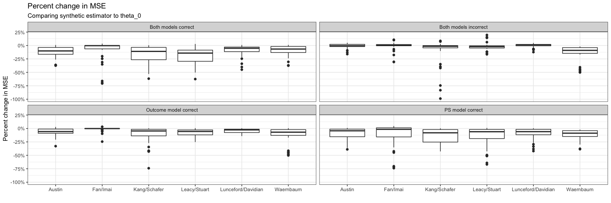
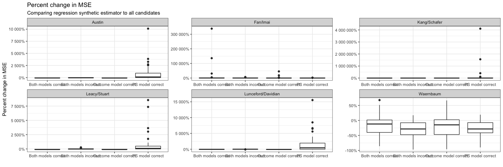

Compute MSEs of canonical simulations
================
dagniel
2019-04-24

``` r
library(knitr)
opts_chunk$set(warning = FALSE, message = FALSE, cache = FALSE, fig.width = 15, fig.height = 5)
```

``` r
library(tidyverse)
library(here)
library(glue)
library(synthate)
theta_s_mse <- read_csv(
  here('results/canonical-sim_synthetic-mses.csv'))
theta_mse <- read_csv(
          here('results/canonical-sim_candidate-mses.csv'))
```

We can combine these results to compare each synthetic estimator (i.e., using each candidate estimator as *θ*<sub>0</sub>) to its own *θ*<sub>0</sub>.

``` r
combined_mses <- theta_s_mse %>%
  inner_join(theta_mse) %>%
  mutate(mse_ratio = synthetic_mse/candidate_mse,
         improvement = mse_ratio - 1,
         j_n = case_when(
           j == 1 ~ 'Both models correct',
           j == 2 ~ 'PS model correct',
           j == 3 ~ 'Outcome model correct',
           j == 4 ~ 'Both models incorrect'
         ),
         d_n = case_when(
           d == 'fi' ~ 'Fan/Imai',
           d == 'iw' ~ 'Waernbaum',
           d == 'ks' ~ 'Kang/Schafer',
           d == 'ls' ~ 'Leacy/Stuart',
           d == 'pa' ~ 'Austin',
           d == 'ld' ~ 'Lunceford/Davidian'
         ))
```

First we look at the results for all simulations.

``` r
ggplot(combined_mses,
       aes(x = j_n, y = improvement, group = j_n)) +
  geom_boxplot() +
  scale_y_continuous(labels = scales::percent) +
  theme_bw() +
  labs(y = 'Percent change in MSE', x = '') +
  ggtitle('Percent change in MSE',
         subtitle = 'Comparing synthetic estimator to theta_0')
```


It turns out there is something really weird going on with the Iacus and King simulation. Here are the results excluding that DGP.

``` r
ggplot(combined_mses %>% filter(d != 'ik'),
       aes(x = j_n, y = improvement, group = j_n)) +
  geom_boxplot() +
  scale_y_continuous(labels = scales::percent) +
  theme_bw() +
  labs(y = 'Percent change in MSE', x = '') +
  ggtitle('Percent change in MSE',
          subtitle = 'Comparing synthetic estimator to theta_0')
```


These results are similar but not quite as strong as Bing's original picture. Because the Iacus and King DGP is so different, it's also interesting to look at this by DGP.

``` r
ggplot(combined_mses %>% filter(d != 'ik'),
       aes(x = d_n, y = improvement, group = d_n)) +
  geom_boxplot() +
  scale_y_continuous(labels = scales::percent) +
  facet_wrap(~ j_n) +
  theme_bw() +
  labs(y = 'Percent change in MSE', x = '') +
  ggtitle('Percent change in MSE',
          subtitle = 'Comparing synthetic estimator to theta_0')
```



``` r
### Comparing using regression as theta_0 to all the candidate estimators
```

The previous analyses looked at all possible *θ*<sub>0</sub>s. Here, we can choose a particular *θ*<sub>0</sub> and compare to all candidates. Let's see what results look like if we use the regression estimator as *θ*<sub>0</sub>. We'll again exclude Iacus and King.

``` r
regr_theta_0 <- theta_s_mse %>%
  filter(theta_0 == 'ate_regr') %>%
  select(-theta_0) %>%
  inner_join(theta_mse) %>%
  mutate(mse_ratio = synthetic_mse/candidate_mse,
         improvement = mse_ratio - 1,
         j_n = case_when(
           j == 1 ~ 'Both models correct',
           j == 2 ~ 'PS model correct',
           j == 3 ~ 'Outcome model correct',
           j == 4 ~ 'Both models incorrect'
         ),
         d_n = case_when(
           d == 'fi' ~ 'Fan/Imai',
           d == 'iw' ~ 'Waernbaum',
           d == 'ks' ~ 'Kang/Schafer',
           d == 'ls' ~ 'Leacy/Stuart',
           d == 'pa' ~ 'Austin',
           d == 'ld' ~ 'Lunceford/Davidian'
         ))

ggplot(regr_theta_0 %>% filter(d != 'ik'),
       aes(x = j_n, y = improvement, group = j_n)) +
  geom_boxplot() +
  scale_y_continuous(labels = scales::percent) +
  theme_bw() +
  labs(y = 'Percent change in MSE', x = '') +
  ggtitle('Percent change in MSE',
          subtitle = 'Comparing regression synthetic estimator to all candidates') +
  facet_wrap(~ d_n, scales = 'free')
```


