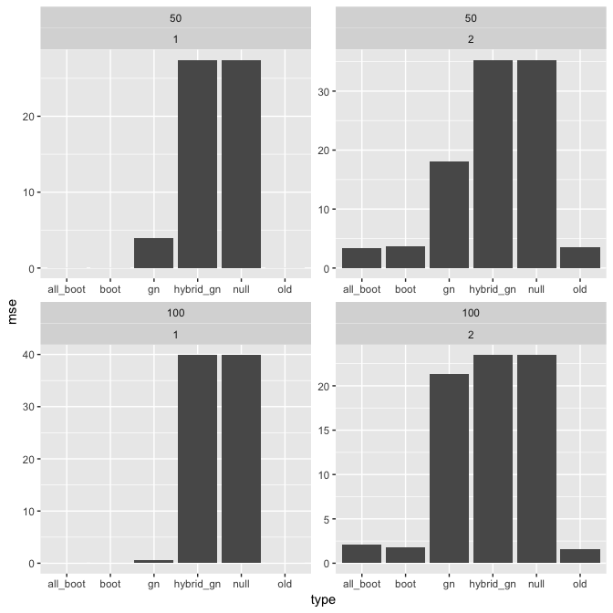

Comparing treatment assignments for alternative outcomes
================
dagniel
Tue Feb 5 12:37:49 2019

``` r
library(knitr)
opts_chunk$set(warning = FALSE, message = FALSE, cache = FALSE, fig.width = 7, fig.height = 7)
```

``` r
# devtools::install_github('denisagniel/synthate')
library(dplyr)
library(clustermq)
library(ggplot2)
library(here)
library(synthate)
library(purrr)
library(readr)

tree_sim <- function(ate_list, n, j, d, B, s) {
  library(splines)
  library(stringr)
  library(purrr)
  library(tidyr)
  library(dplyr)
  library(clustermq)
  library(synthate)
  library(grf)
  print(
    glue::glue('Sample size is {n}; the outcome is {(j %in% c(1,3))}; the PS is {(j %in% c(1,2))}; the DGP is {d}; the seed is {s}.')
  )
  set.seed(s)
  gen_mod <- generate_data(n = n, dgp = d, 
                           correct_outcome = (j %in% c(1,3)),
                           correct_ps = (j %in% 1:2))
  this_data <- gen_mod$data
  outcome_fm <- gen_mod$outcome_fm
  outcome_fam <- gen_mod$outcome_fam
  ps_fm <- gen_mod$ps_fm
  ps_fam <- gen_mod$ps_fam
  cov_ids <- gen_mod$cov_ids
  print('data generated..')
  this_data <- estimate_scores(this_data, outcome_fm = outcome_fm,
                               ps_fm = ps_fm,
                               ps_fam = ps_fam,
                               outcome_fam = outcome_fam)
  print('scores estimated...')
  thetahat <- estimate_ates(this_data,
                            ate_list,
                            cov_ids = cov_ids,
                            outcome_fm = stringr::str_c('d + ', outcome_fm),
                            outcome_fam = outcome_fam)
  print('initial thetas estimated...')
  X <- this_data %>% select(one_of(cov_ids), d)
  Y <- this_data$y
  grf_fit <- regression_forest(X = X, Y = Y)
  print('prediction model fit...')
  predict_regr <- function(d) {
    unlist(predict(grf_fit, newdata = d))
  }
  browser()
  resample_thetas <- 
    resample_fn(dat = this_data,
                predfn = predict_regr,
                B = B,
                ate_list = ate_list,
                outcome_fm = outcome_fm,
                ps_fm = ps_fm,
                ps_fam = ps_fam,
                outcome_fam = outcome_fam)
  print('resampling done...')
  boot_theta <- resample_thetas[[1]] %>% as.matrix
  null_theta <- resample_thetas[[2]] %>% as.matrix
  gn_theta <- resample_thetas[[3]] %>% as.matrix
  
  
  #------------------------
  ## this way uses regular bootstrap and raw differences
  #--------------------------
  old_way <- combine_estimators(thetahat,
                                boot_ests = boot_theta,
                                name_0 = 'ate_dr',
                                bias_type = 'raw_diff')
  #-------------------------
  ## naming a theta_0 but getting the biases comparing the 
  #### bootstrap estimates to the thetahat_0 from the original sample
  boot_way <- combine_estimators(thetahat,
                                 boot_ests = boot_theta,
                                 name_0 = 'ate_dr',
                                 bias_type = 'bootstrap')
  
  #-------------------------
  ## bing's new way, where you name a theta_0 and get the biases by computing the  
  #### bootstrap mean of thetahat_1 - thetahat_0
  all_boot_way <- combine_estimators(thetahat,
                                     boot_ests = boot_theta,
                                     name_0 = 'ate_dr',
                                     bias_type = 'bootstrap_all')
  #---------------------------
  ## null method
  null_way <- combine_estimators(thetahat,
                                 boot_ests = null_theta,
                                 name_0 = 'ate_dr',
                                 bias_type = 'bootstrap',
                                 ate_0 = 0)
  #--------------------------
  ## gn method
  gn_ate_0 <- mean(
    predict_regr(this_data %>% mutate(d = 1)) - 
      predict_regr(this_data %>% mutate(d = 0))
  )
  gn_way <- combine_estimators(thetahat,
                               boot_ests = gn_theta,
                               name_0 = 'ate_dr',
                               bias_type = 'bootstrap',
                               ate_0 = gn_ate_0)
  
  #--------------------------
  ## just using the prediction model for the ate, but not for the bootstrapping
  hybrid_boot_gn_way <- combine_estimators(thetahat,
                                           boot_ests = boot_theta,
                                           name_0 = 'ate_dr',
                                           bias_type = 'bootstrap',
                                           ate_0 = gn_ate_0)
  
  alvvays <- list(
    old_way,
    boot_way,
    all_boot_way,
    null_way,
    gn_way,
    hybrid_boot_gn_way
  )
  
  all_synthetic_thetas <- map(alvvays, 'ate_res') %>%
    bind_rows %>%
    filter(!shrunk) %>%
    mutate(type = c('old', 'boot', 'all_boot', 'null', 'gn', 'hybrid_gn'))
  
  all_bs <- map(alvvays, 'b_res') %>%
    bind_rows %>%
    filter(!shrunk) %>%
    mutate(type = rep(c('old', 'boot', 'all_boot', 'null', 'gn', 'hybrid_gn'), each = 4))
  
  return(list(thetas = all_synthetic_thetas,
              bs = all_bs))
  
}

sim_parameters <- expand.grid(
  run = 1:2,
  j = 1:2,
  n = c(50, 100),
  d = c('ks')
)
sim_parameters <- sim_parameters %>%
  mutate(sim = as.character(1:nrow(sim_parameters)))

options(clustermq.scheduler = "multicore")
sim_res <- Q(tree_sim, 
                         j = sim_parameters$j,
                         n = sim_parameters$n,
                         s = sim_parameters$run,
                         const = list(
                           ate_list = list(
                             ipw2_ate,
                             regr_ate,
                             dr_ate,
                             strat_ate),
                           B = 200,
                           d = 'ks'),
                         n_jobs = 4
)

theta_res <- map(sim_res, 'thetas') %>%
  bind_rows(.id = 'sim') %>%
  inner_join(sim_parameters) %>%
  select(-(theta_0:shrunk))
write_csv(theta_res,
          here(
  'results/comparison_sim_thetas.csv'
))
mse_res <- theta_res %>%
  group_by(j, n, d, type) %>%
  summarise(mse = mean((ate - 40)^2))

ggplot(mse_res, aes(x = type, y = mse)) +
  geom_col() +
  facet_wrap(n ~ j, scales = 'free')
```



``` r
b_res <- map(sim_res, 'bs') %>%
  bind_rows(.id = 'sim') %>%
  inner_join(sim_parameters) %>%
  select(-(theta_0:shrunk))
write_csv(b_res, here(
  'results/comparison_sim_bs.csv'
))

b_sum <- b_res %>%
  group_by(j, n, d, est, type) %>%
  summarise(bhat = mean(b),
            bvar = var(b))
ggplot(b_sum, aes(x = est, y = bhat, group = type, fill = type)) +
  geom_col(position = 'dodge') +
  facet_wrap(n ~ j, scales = 'free')
```


``` r
sessionInfo()
```

    ## R version 3.5.2 (2018-12-20)
    ## Platform: x86_64-apple-darwin15.6.0 (64-bit)
    ## Running under: OS X El Capitan 10.11.6
    ## 
    ## Matrix products: default
    ## BLAS: /System/Library/Frameworks/Accelerate.framework/Versions/A/Frameworks/vecLib.framework/Versions/A/libBLAS.dylib
    ## LAPACK: /Library/Frameworks/R.framework/Versions/3.5/Resources/lib/libRlapack.dylib
    ## 
    ## locale:
    ## [1] en_US.UTF-8/en_US.UTF-8/en_US.UTF-8/C/en_US.UTF-8/en_US.UTF-8
    ## 
    ## attached base packages:
    ## [1] stats     graphics  grDevices utils     datasets  methods   base     
    ## 
    ## other attached packages:
    ## [1] readr_1.3.1     purrr_0.2.5     synthate_0.1.0  ggplot2_3.1.0  
    ## [5] clustermq_0.8.5 dplyr_0.7.8     knitr_1.21      here_0.1       
    ## [9] bindrcpp_0.2.2 
    ## 
    ## loaded via a namespace (and not attached):
    ##  [1] Rcpp_1.0.0        plyr_1.8.4        pillar_1.3.1     
    ##  [4] compiler_3.5.2    highr_0.7         bindr_0.1.1      
    ##  [7] prettyunits_1.0.2 progress_1.2.0    tools_3.5.2      
    ## [10] rmsfact_0.0.3     digest_0.6.18     gtable_0.2.0     
    ## [13] evaluate_0.12     tibble_2.0.1      pkgconfig_2.0.2  
    ## [16] rlang_0.3.1       rstudioapi_0.9.0  parallel_3.5.2   
    ## [19] yaml_2.2.0        xfun_0.4          rzmq_0.9.4       
    ## [22] withr_2.1.2       stringr_1.3.1     hms_0.4.2        
    ## [25] rprojroot_1.3-2   grid_3.5.2        tidyselect_0.2.5 
    ## [28] glue_1.3.0        R6_2.3.0          rmarkdown_1.11   
    ## [31] multicolor_0.1.1  tidyr_0.8.2       magrittr_1.5     
    ## [34] scales_1.0.0      backports_1.1.3   fortunes_1.5-4   
    ## [37] htmltools_0.3.6   assertthat_0.2.0  colorspace_1.4-0 
    ## [40] labeling_0.3      stringi_1.2.4     cowsay_0.7.0     
    ## [43] lazyeval_0.2.1    munsell_0.5.0     crayon_1.3.4
